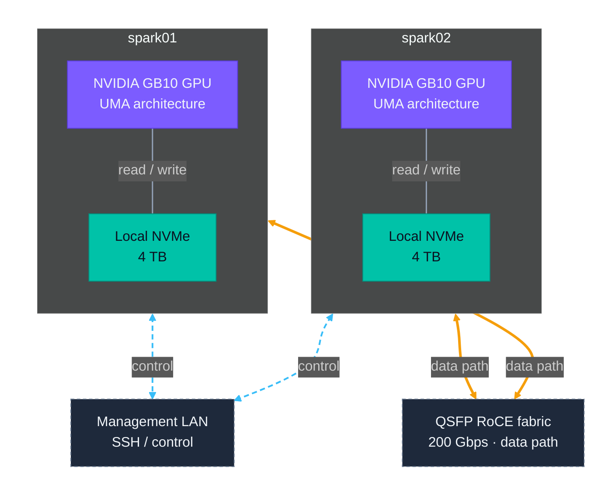

# AIHomeLab

Storage is the bottleneck that keeps GPU dollars idle. This lab measures the exact I/O behavior of real AI workloads — data prep, fine-tuning, vLLM serving — on physical DGX hardware.

I am Kumar Nachiketa, and I have been privileged to work in data storage and watch the field transition over the last 20 years: on-prem, cloud, and now AI infrastructure. This lab is the bench where I test ideas and fundamentals — sometimes just out of curiosity, sometimes to establish a pattern worth testing at small scale and applying at any scale.

*Two DGX Spark nodes share a management LAN for control and a direct 200 Gbps QSFP RoCE fabric for high-bandwidth data movement. Each node has a dedicated 4 TB local NVMe.*

## Headline numbers

- **6× difference in checkpoint write wall-clock based on page cache state alone** — same workload, same hardware, page cache state dominates. → [storage touch points](artifacts/training/full-sft-storage-touchpoints/full-sft-storage-touchpoints.md)
- **Mid-training checkpoints are doubly expensive on UMA** — the sync block plus a sustained training-slowdown tail that drop_caches cannot mitigate, because the workload pins the cache. → [storage touch points](artifacts/training/full-sft-storage-touchpoints/full-sft-storage-touchpoints.md)
- **NVMe spec-to-ML-effective gap is 22×, with SLC fall-off as the dominant component** — three stacked gaps: 1.13× spec-to-burst, 6× burst-to-sustained (SLC fall-off), 3.3× sustained-to-ML-effective (loader pattern). Drive choice or smaller writes fix the SLC gap; loader tweaks fix the loader gap. → [Spark NVMe FIO baseline](artifacts/data-prep/spark-nvme-fio-baseline/spark-nvme-fio-baseline.md)
- **NFS-over-TCP writes 13% faster than NFS-over-RDMA in sync-export regime** — per-op fsync rate dominates throughput, not transport bandwidth; RDMA's wins concentrate in NFS reads (5×) and non-NFS workloads. Don't generalize to "RDMA is slower for writes" — strip any one factor (async export, larger blocks, mature NFSoRDMA stack) and RDMA wins. → [multi-node training storage](artifacts/training/multi-node-training-storage/multi-node-training-storage.md)
- **Three persistent ZFS+Lustre knobs (`primarycache=metadata`, `atime=off`, `obdfilter.brw_size=4`) decide whether file-backed-zpool Lustre on UMA is usable** — recover ~85% of the single-node loopback ceiling on bulk IO; without them, default config delivers 32× less on 64 KiB writes and 400× less on 4 KiB random IOPS. `primarycache=metadata` on the OST dataset is the single load-bearing knob. → [Lustre on UMA workstations](artifacts/training/lustre-on-uma-workstations/lustre-on-uma-workstations.md)

## What's measured

- [Spark NVMe FIO baseline](artifacts/data-prep/spark-nvme-fio-baseline/spark-nvme-fio-baseline.md). How to baseline NVMe for AI infrastructure, with the SLC fall-off as the dominant write gap. 8-job FIO sweep + reproduce kit any practitioner can run.
- [Storage touch points in AI training](artifacts/training/full-sft-storage-touchpoints/full-sft-storage-touchpoints.md). Seven touch points characterized end-to-end on one DGX Spark + Qwen3-8B; the 6× page-cache pattern in checkpoint consolidation; small-system measurements transfer to large-scale infrastructure planning.
- [Multi-node training storage](artifacts/training/multi-node-training-storage/multi-node-training-storage.md). How to choose distributed-training storage by measuring read-vs-write dominance over your specific fabric, with NFSoRDMA on a 2-host UMA cluster as the worked example. Three-way comparison (single-node / multinode + rsync / multinode + shared-FS) showing shared FS pays a 5× per-checkpoint tax to eliminate the post-training sync layer entirely — and wins on total cost.
- [Lustre on UMA workstations](artifacts/training/lustre-on-uma-workstations/lustre-on-uma-workstations.md). How to stand up minimum-viable distributed Lustre on 2 UMA workstations with stock single-NVMe layouts (no destructive partitioning), and which configuration knobs are load-bearing. Three-knob trio recovers ~85% of loopback ceiling; default is unusable. Cross-node Lustre is architecturally ~6× slower than NFSoRDMA on cached reads (RPC framing + LDLM + osd-zfs + ko2iblnd stack depth); distributed Lustre's win is concurrent multi-client where aggregate hits 60–85% of loopback. Six-obstacle build cascade documented; reproduce time compresses 5× with the recipe encoded.

Full catalog with stage breakdown: [artifacts/](artifacts/).

## Where to start

- **Storage architect / capacity planner** → the results above, then [artifacts/scope-and-caveats.md](artifacts/scope-and-caveats.md) for what bounds the numbers.
- **Have any single NVMe and want to baseline it** → [artifacts/data-prep/spark-nvme-fio-baseline/reproduce/](artifacts/data-prep/spark-nvme-fio-baseline/reproduce/) — 8 FIO jobs + orchestrator, ~30 min wall clock + 2.2 TB free disk.
- **Have similar training hardware (DGX Spark, Grace, UMA platform) and want to try a finding** → [artifacts/training/full-sft-storage-touchpoints/reproduce/](artifacts/training/full-sft-storage-touchpoints/reproduce/) — 4 bash scripts (smoke / c25 / c100 / restore) plus an iostat-timeline analyzer; ~35 min wall clock + ~450 GB free disk.
- **Have a 2-host UMA pair and want to stand up Lustre** → [artifacts/training/lustre-on-uma-workstations/reproduce/](artifacts/training/lustre-on-uma-workstations/reproduce/) — 11 setup/run scripts encoding the six-obstacle build cascade, the load-bearing knob trio, and the three-pillar measurement battery; ~3 hours wall clock + ~650 GB per host (file-backed zpools).

## Lab

Workloads: NeMo AutoModel fine-tuning, vLLM serving. Full hardware and network details: [environment/cluster-env.md](environment/cluster-env.md).

## Counter-evidence welcome

Findings here are measured on a specific platform; data that contradicts a claim is more useful to me than data that confirms it. Open a thread in [GitHub Discussions](../../discussions).

## How to cite

> Nachiketa, K. (2026). *AIHomeLab: storage measurements for AI infrastructure on DGX Spark.* Retrieved from https://github.com/knachiketa04/aihomelab

## License and disclaimer

Documentation is licensed under [CC-BY-4.0](LICENSE). AIHomeLab is a personal project and is not affiliated with, sponsored by, or endorsed by any employer. See [LICENSE](LICENSE) for the full disclaimer.
