# What I learned building an LLM pipeline on a workstation

*My notes on building an end-to-end LLM pipeline on a home lab of two NVIDIA DGX Spark workstations, one phase at a time, and watching the storage behave at every step.*

> **What this is.** I built a small but complete LLM pipeline at home: ingest the data, generate the training set, fine-tune a model, evaluate it, serve it. Storage is what I do, so I instrumented the I/O at every stage. This article walks each stage for two readers at once: a non-specialist who wants the use case, and an infrastructure engineer who wants the real per-stage numbers plus a read on how each one changes at enterprise scale. Every number traces to a real run. Where I project to larger scale, I say so and label it as projection, not data, and I keep those projections strictly qualitative.

---

## The recipe assistant I built for my wife

Here is the whole thing in one sentence: my wife types "a vegan Punjabi curry with chickpeas and spinach, no coconut," and a model running on two workstations in my house writes her a complete recipe, with substitutions, steps, and the technique notes a good cookbook would include.

That is the use case. It is small and personal on purpose. Our home diet is vegetarian (which includes vegan), so the model has a real user and a real job, and the data sources are permissively licensed, which means the whole pipeline is reproducible and shareable.

The real reason I built it, though, is storage. A few days ago I published a [map of where storage shows up across an LLM pipeline](../storage-touchpoints-map/storage-touchpoints-map.md), data prep through serving, stage by stage. That was the theory, written from first principles and industry references. This time I wanted to live it: stand up every stage on my own hardware and watch each touch point actually behave, end to end, at a functional level. The recipe assistant is the vehicle; the storage is the subject.

To be clear about what this is not. Running this at home with teacher-student distillation is not a claim that it is the best way to get good vegan recipes. It almost certainly is not. My wife's phone already has a Gemini subscription that would write a better recipe than my fine-tuned 8B student does. I did not pick the optimal use case or the optimal implementation; I picked one I would actually use, that exercises every storage touch point, and that I can share end to end. The point was the journey through the pipeline, not beating a frontier model at recipes.

To get there, I built the standard LLM pipeline end to end, one phase at a time:

- **Ingest** recipes from three public sources (Wikibooks Cookbook, Project Gutenberg, Wikipedia food articles) and **clean** them into a usable corpus.
- **Generate** an instruction-tuning dataset by having a *big* model write training examples for a *small* one. This is **teacher-student distillation**: a 32-billion-parameter teacher produces the question-and-answer pairs that teach an 8-billion-parameter student.
- **Fine-tune** the small student on that dataset, two ways: a lightweight **LoRA** adapter and a full-parameter retrain.
- **Evaluate** whether the student actually stays vegan and writes coherent recipes.
- **Serve** the student through vLLM so my wife can use it.

Along the way the pipeline uses the things you would expect a modern LLM stack to use: streaming model loaders, prefix caching, near-duplicate detection, distributed checkpointing across two nodes. I name each one in plain terms when we reach it.

**One licensing note that shaped a real decision.** I used Qwen3-32B as the teacher, not a frontier API model, and the reason is licensing, not capability. If you generate a training set with a hosted frontier API, the provider's terms typically restrict using those outputs to train a competing model, and the license on the *output* is murky. An openly-licensed teacher I run myself has none of that ambiguity: the data is mine to publish. For a pipeline whose whole point is to be shareable, the teacher's license is a first-class design input.

**Who this is for.** If you work in infrastructure (storage, network, compute) and you are being pulled toward AI work, this is a tour of where the bottlenecks actually live in an LLM pipeline, measured rather than assumed. The going-in instinct for someone with my background is to suspect storage. The interesting part is watching, stage by stage, where that instinct is right, where it is wrong, and what would have to change for it to flip. There is a deeper reason this is easy to get wrong: across a lot of use cases, even sophisticated ones, you do not hit a storage bottleneck in the early or proof-of-concept stage at all. A modestly sized cloud box on default settings does the job, and storage never enters the conversation. I built a complete teacher-student distillation pipeline from a raw corpus of just 12.8 MiB; at that size a default machine handles every stage and storage stays invisible. That invisibility is the trap: it is why storage gets left out of the plan entirely, right up to the scale where it stops being optional. Each stage ends with an enterprise-scale aside for the reader who cares about the large version of the same problem.

> **Try it on your own DGX Spark.** The whole pipeline ships as an [end-to-end reproduce kit](reproduce/): the as-run scripts for every stage (ingest and clean, synthetic generation, fine-tune, eval, serve) plus a run guide. Paths and hosts are parameterized, so it adapts to other hardware too.

---

## The pipeline at a glance


<details>
<summary>Diagram source (Mermaid)</summary>

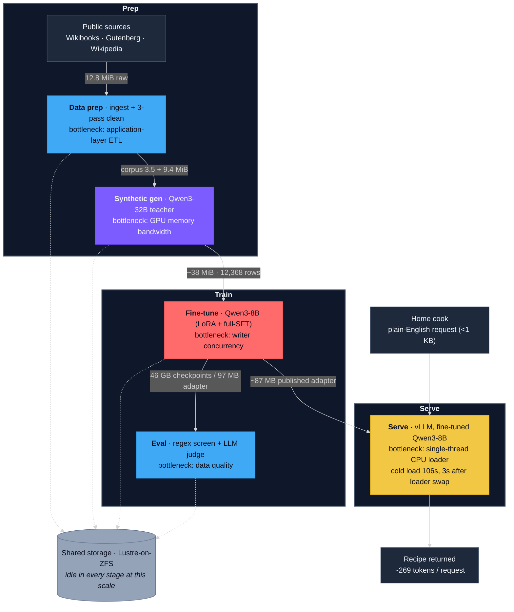

To re-render after editing: `npx -y @mermaid-js/mermaid-cli -i pipeline.mmd -o pipeline.svg -t dark -b transparent`

</details>

**Color = the bottleneck layer at workstation scale.** Blue is application-layer (parsing, data quality), violet is GPU memory bandwidth, amber is single-thread CPU, coral is client-side write concurrency. The storage substrate (grey) stayed idle at every stage. The three boxes are the coarse model every LLM pipeline shares, prep then train then serve, the same three the [storage touch-points companion](../storage-touchpoints-map/storage-touchpoints-map.md) is organized around; inside them, the five stages each keep their own distinct bottleneck, which is what the colors track. The home cook talks only to the serve phase; everything feeding it is the offline build that produces the model she uses.

---

## The one piece of hardware you need in your head

A DGX Spark is a Grace-class GB10: CPU and GPU on one die, sharing **one pool of memory** (unified memory, UMA). There is no separate "GPU memory" to copy weights into; the CPU and GPU read the same LPDDR5X. The number that matters all the way through this article is that pool's bandwidth: about **273 GB/s**. A server-class H100 delivers roughly 3,350 GB/s from its HBM3, about 12 times more. That single ratio explains most of what a workstation can and cannot do, and it shows up again the moment we start generating tokens.

Two practical consequences of one shared pool. First, "load the model" and "fill the page cache" compete for the same physical RAM, so caching behavior is different from a discrete-GPU box. Second, the tools lie: `nvidia-smi` reports "Memory-Usage: Not Supported" on UMA because there is no distinct GPU pool to measure. Watch the system memory and the per-core CPU instead.

That is the whole primer. The rest of the physics shows up where it bites, which is the next stage.

> **At enterprise scale.** A production accelerator inverts almost every number above. Server-class GPUs carry much higher memory bandwidth, sit next to fast local SSD, and reach across several networked storage tiers: a parallel or shared filesystem for training data and checkpoints, object storage as the durable foundation, and purpose-built read-mostly tiers for serving weights. Whether any one of those tiers actually becomes your bottleneck is not a given. It depends on the use case, the model, and the framework parameters you set. That is the lens for the rest of this article: do not assume a layer is the constraint, measure which one is, because the answer moves with the workload.

---

## Stage 1 — Data prep: storage so over-provisioned it does not register


<details>
<summary>Diagram source (Mermaid)</summary>

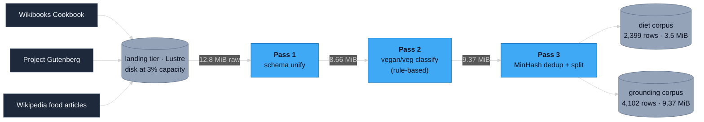

To re-render after editing: `npx -y @mermaid-js/mermaid-cli -i stage1-data-prep.mmd -o stage1-data-prep.svg -t dark -b transparent`

</details>

*Three sources, three cleaning passes, all sub-second. The work is parsing and classification (blue, application-layer); the storage (grey) never registers at this size.*

**Going in:** ingest and cleaning are the classic "I/O-bound" chores. Read a pile of files, parse, write a pile of files. My instinct said watch the disk.

**What I measured:** three sources pulled in parallel into a shared landing tier, then three sequential cleaning passes (unify the schemas, tag vegan and vegetarian with a rule-based classifier, then **MinHash deduplication**, which is a cheap way to catch near-duplicate recipes that are not byte-identical). The raw corpus was **12.8 MiB**. Each pass read and wrote single-digit MiB (12.8 in, 8.66 after unify, 9.37 after tagging) in **under a second per pass**, the full clean finished in under five minutes of wall-clock, and the shared filesystem sat at **3% of capacity** the whole time. At one-second sampling, the storage telemetry produced no resolved signal at all. The numbers are sub-sampling-noise.

**Where the bottleneck actually was:** the application layer. The time went into JSON parsing, schema reconciliation across three very different source formats, regex classification, and the dedup hashing. A representative catch: my first classifier marked 23 catfish recipes as vegan, because a `fish` word-boundary regex does not match "catfish." That class of bug, not disk throughput, is what you fight at this scale.

**Where storage flips:** at ~13 MiB the storage tier is over-provisioned by three-plus orders of magnitude. Single-node cleaning scales roughly linearly with corpus size, so a 1 GB corpus is still seconds-to-minutes of CPU and the disk is still asleep. Storage becomes a first-order concern only at petabyte-scale ingest, where sustained write throughput binds against shared-filesystem ceilings like the ~1.35 GB/s measured on this hardware. **[The 12.8 MiB measurements are real; the step up to petabyte scale is a projection, not data.]**

> **At enterprise scale.** Real data-prep use cases look nothing like the tiny corpus here. They routinely run to several petabytes, and increasingly multimodal ones: images, video, and the multi-dimensional arrays behind them. Our corpus was so small it put no pressure on the Spark at all, which is exactly why storage stayed invisible here. At petabyte scale the picture changes: cleaning, dedup, and synthetic generation can consume large amounts of time, CPU, memory, and sometimes GPUs; they run as distributed jobs whose durable foundation is object storage, which itself has to scale into the multi-petabyte range to hold the raw corpus, the intermediates, and the final shards; and they rewrite the dataset many times before those shards land. That is where the data-prep touch points start to bite, and the format and tier choices made here set the read ceiling for everything downstream.

---

## Stage 2 — Teaching a small model with a big one, and meeting the memory wall


<details>
<summary>Diagram source (Mermaid)</summary>

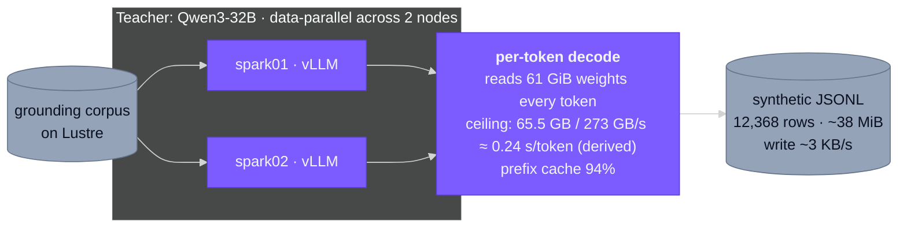

To re-render after editing: `npx -y @mermaid-js/mermaid-cli -i stage2-synthetic-gen.mmd -o stage2-synthetic-gen.svg -t dark -b transparent`

</details>

*A 32B teacher writes the student's training set. Generation speed is set by memory bandwidth (violet): each token rereads all 61 GiB of weights. Cold-loading the teacher (149 MiB/s effective) and writing the output (3 KB/s) leave storage (grey) idle.*

**Going in:** this is the first heavy GPU stage. A 32B teacher generates roughly 20,000 instruction-response pairs (I landed about 12,000 before a hardware stall I come back to below). The teacher's weights are about 61 GiB, they live on the shared filesystem, and the output is a stream of JSONL. My storage question: does loading and re-loading a 61 GiB model from Lustre cost real time, and does the output write rate matter?

**The physics, where it finally bites.** Generating a token is not mostly computation. For every output token, the GPU must read the entire model's weights through memory once, multiply them against the current activations, and pick the next token. The arithmetic per byte is trivial; the cost is getting the bytes out of memory. So the floor on generation speed is set by memory bandwidth, not compute:

```text
seconds per token  ≥  model bytes / memory bandwidth
61 GiB ≈ 65.5 GB ;  65.5 GB / 273 GB/s  ≈  0.24 sec/token
```

That 0.24 is a derived ceiling, the fastest a single stream could possibly decode this teacher on this box. I did not capture a clean single-stream per-token latency in this run, so I am presenting 0.24 as arithmetic, not as a measurement. What batching does is rescue *throughput*, not latency: with many concurrent requests, each weight-read pass advances all of them by one token, so the per-token read cost amortizes across the batch. Latency per request stays put; tokens-per-second across the server goes up. The measured aggregate in the pilot was about **0.6 requests per second per node** at batch size 32, which is the throughput side of exactly this trade.

**What I measured on the storage path:** cold-loading the 61 GiB teacher from Lustre took **419 to 432 seconds** on a clean start, an effective read of about **149 MiB/s**, and (this is the important part) cold and warm reads landed within 3% of each other. (Production reloads under accumulated allocator pressure ran longer, to around 487 to 519 seconds, but a warmer cache never made the load faster.) The output JSONL trickled out at about **3 KB/s**, a few tens of MiB total. Prefix caching (reusing the shared instruction preamble across requests) hit **94%**.

**Where the bottleneck actually was:** not storage, on two counts. The cold-load read rate is two orders of magnitude below what the NVMe can do, and it does not change with cache state, so the load is CPU-bound deserialization, not disk. And generation itself is bounded by that 273 GB/s memory wall. There was also a third, harder ceiling: on this UMA hardware, the GPU allocator accumulated pressure across dozens of model reloads and eventually wedged the node, which is what capped the run at ~12,000 rows. That is a reliability limit, not a storage or throughput one, and it is its own story.

**What the dataset became.** Those 12,368 raw generations cleaned down to 11,582 released instruction pairs after parsing, formatting, and dedup, split 10,424 train / 579 validation / 579 test. That train split is the ~10.4K rows the fine-tune stage reads in the next section.

**Where storage flips:** it does not, on the generation path. A bigger teacher loads linearly slower per GiB regardless of storage tier (it is CPU-bound), and generation is bandwidth-bound, so a faster disk buys nothing here at any model size. **[The cold/warm 3% spread is measured; the memory-bandwidth ceiling is derived arithmetic the run never reached, because the allocator wedged first.]**

> **At enterprise scale.** Generation at home loads the teacher once and trickles the output. Training or generating against a large corpus changes which touch points matter. The dataset stream becomes a continuous, sustained sequential read rather than a one-time load, and batch size turns into a first-order storage parameter, because the loader has to keep every accelerator fed without stalling. This is the training-read touch point doing real work, and it is one of the regimes where a slow or mis-sized data tier shows up directly as idle accelerators, the most expensive thing in the building.

---

## Stage 3 — Fine-tuning, the stage I was most sure would be storage-bound


<details>
<summary>Diagram source (Mermaid)</summary>

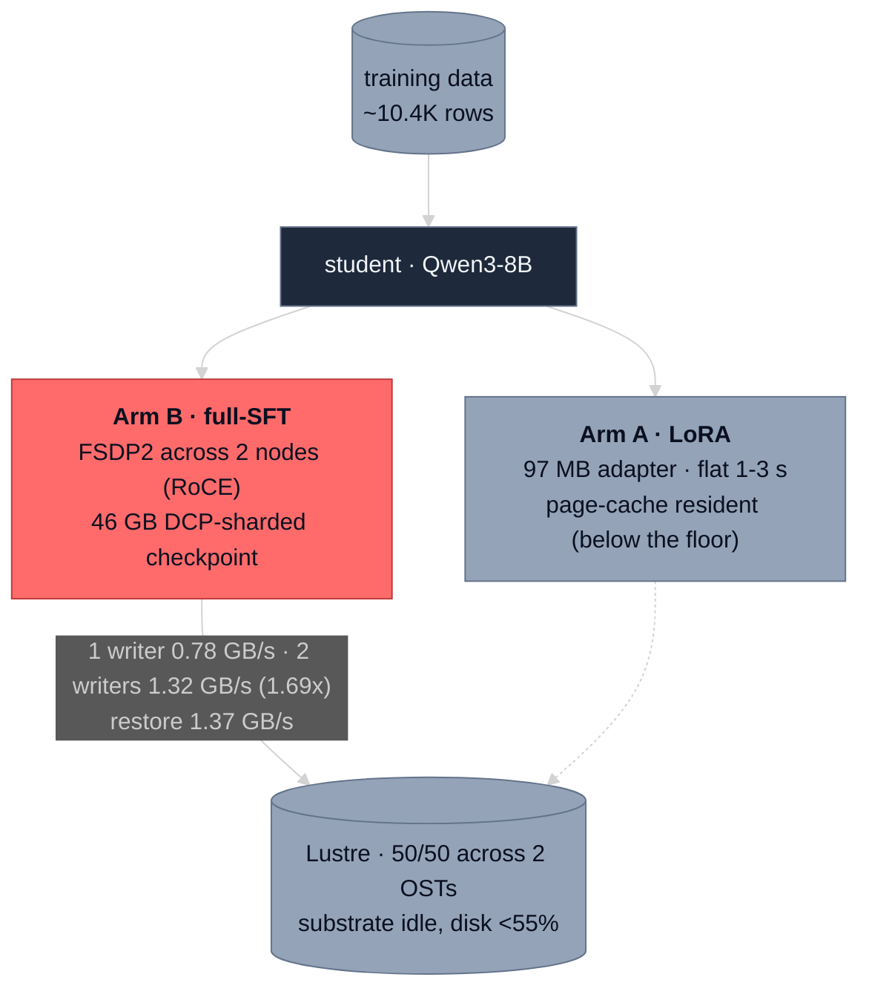

To re-render after editing: `npx -y @mermaid-js/mermaid-cli -i stage3-fine-tune.mmd -o stage3-fine-tune.svg -t dark -b transparent`

</details>

*Two ways to checkpoint. LoRA's 97 MB write (grey) is below the size where storage behavior is even visible. Full-SFT's 46 GB write is real, but client-bound (coral): the substrate (grey) loafs while writer concurrency, not the disk, sets the rate.*

**Going in:** this is where checkpoints get written, and checkpoints are the one training workload that is unambiguously a storage write. If storage was going to be the bottleneck anywhere in this pipeline, my money was here. I ran it two ways.

### Arm A — LoRA: checkpoints too small to see

LoRA trains a small low-rank adapter instead of the whole model, so what you save is tiny. Each adapter checkpoint was **97 MB**, written flat in **1 to 3 seconds**, and it stayed resident in the page cache (no cold re-read penalty). The published adapter is a bit smaller, about 87 MB, after the `lm_head` LoRA pair is stripped so vLLM will load it. Across a 70-minute run, checkpoint writes were about 12 seconds of 4,200. The save is below the floor where storage behavior is even observable. The real cost was compute: roughly 5.7 seconds per training step.

### Arm B — Full-parameter SFT: the richest storage data in the whole pipeline

Full SFT retrains every weight, so the checkpoints are real: about **46 GB each** (16 GB of model plus 30 GB of optimizer state), written DCP-sharded across both nodes over the RoCE fabric to Lustre-on-ZFS. I compared one writer against two, and measured the restore read.

| Pattern | Throughput | Per checkpoint | Disk busy | Bound by |
| --- | --- | --- | --- | --- |
| Write, 1 writer | **0.78 GB/s** | 59 s | under 55% | client latency |
| Write, 2 writers | **1.32 GB/s** (1.69x) | 35 s | ~42% | writer concurrency |
| Restore read | **1.37 GB/s** | n/a | ~20% | client latency (pipelined) |

**Where the bottleneck actually was:** the client, in every regime, with the storage substrate idle throughout. This one took real work to prove, and it is the most transferable lesson in the article. The single-writer rate (0.78 GB/s) happens to sit inside this stack's own delivered substrate band (roughly 0.5 to 0.8 GB/s), so `iostat %util` is *degenerate*: "the client is the cap" and "the disk is the cap" look identical from disk-busy alone. What settles it is reading the layer that actually knows. The ZFS transaction-group stats show dirty data at a few percent of the cap and sync times far under the timeout (the pool is not throttling, it has headroom), and per-thread CPU shows the writer parked off-CPU 70 to 95% of the write (it is waiting on completions, not burning a core). Substrate idle, client waiting. Two writers nearly doubling throughput while the disk stays under half busy confirms it from the other direction.

**Where storage flips:** throughput here is gated by writer concurrency and per-completion latency, not by the tier. Two writers land right on the ~1.35 GB/s concurrent ceiling an independent test measured on this stack, with disk headroom to spare. Add a third and fourth writer and you climb sub-linearly toward a shared-filesystem coordination wall; that, or a much larger per-checkpoint volume, is what would finally make the substrate the constraint. **[The 1.69x scaling and the substrate-idle attribution are measured; the 3-plus-writer trajectory is a projection, untestable on two nodes.]** A separate caveat: the consolidated single-file checkpoint export path trips a known Lustre client defect on this stack, so these runs use the sharded path, which is safe by construction. That defect is reported upstream rather than reproduced here.

> **At enterprise scale.** A large training run exercises three checkpoint touch points that barely registered here: the training read that feeds the loop, the checkpoint store that writes model and optimizer state on a cadence, and the checkpoint read on restart. At scale the checkpoints are far larger and the cadence is a direct throughput trade: every synchronous checkpoint stalls training while the write drains, so the choice between synchronous and asynchronous checkpointing becomes load-bearing. Asynchronous checkpointing overlaps the write with continued training to hide the stall, at the cost of extra memory pressure and more moving parts. Which one wins depends on the write tier and the cadence, and it is one of the clearest places where storage design changes training wall-clock.

---

## Stage 4 — Eval: an application problem wearing infrastructure clothes


<details>
<summary>Diagram source (Mermaid)</summary>

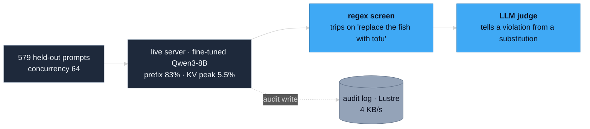

To re-render after editing: `npx -y @mermaid-js/mermaid-cli -i stage4-eval.mmd -o stage4-eval.svg -t dark -b transparent`

</details>

*Eval is a data-quality problem (blue), not a storage one. A cheap regex flags correct substitutions as violations, so the real work is the LLM judge. The audit log (grey) is trivial.*

**Going in:** replay held-out recipe prompts at the live server and watch for any storage touch point under load.

**What I measured:** 579 held-out prompts at concurrency 64. The serving-time storage picture was uneventful and that is the finding: prefix cache **83%** hit, KV cache peaking in the **single-digit percent** of its budget, audit logging at **4 KB/s** at full fidelity. Nothing close to a storage constraint.

**Where the bottleneck actually was:** the quality of the data and the quality of the judge. The interesting failures were dietary, and they come in three flavors. The teacher sometimes slips an animal product into a "vegan" recipe by name (add paneer), sometimes embeds a technique for making the real thing inside a vegan answer, and sometimes simply believes seafood is vegetarian. The first two are vocabulary errors, the third is a belief error, and they need different fixes. This is also why a cheap regex screen is not enough: the blocklist flags "fish" in *"replace the fish with tofu,"* which is a correct substitution, not a violation. Telling a real violation from a correct substitution needs an LLM judge, which is the application-layer work this stage actually demands. (The full breakdown lives in the experiment's notes and the data companion.)

**Where storage flips:** audit logging grows linearly with request rate and stays trivial well past any home-scale load; the KV budget is the real serving ceiling, and it is a memory question, not a storage one. Eval stays an application problem. **[Measured at home-scale traffic; production-rate audit volume is a projection from the linear write rate.]**

> **At enterprise scale.** Eval is application-bound here, and it mostly stays that way at scale: the cost is the judge and the data quality, not the disk. There are two real storage angles that appear at scale, though, and both are about discipline rather than throughput. Held-out eval sets become versioned, immutable, content-addressed datasets, so that a score from one run is comparable to a score from another; that is a durability-and-retention requirement, not a bandwidth one. And when eval results gate a deployment or back a compliance sign-off, the results and the request traces behind them need a retained, durable home. Neither makes eval storage-bound; both make storage part of the eval system you have to plan.

---

## Stage 5 — Serving: a 106-second load while the disk slept


<details>
<summary>Diagram source (Mermaid)</summary>

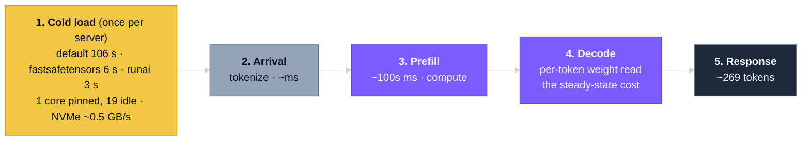

To re-render after editing: `npx -y @mermaid-js/mermaid-cli -i stage5-serve.mmd -o stage5-serve.svg -t dark -b transparent`

</details>

*Where serving time goes. The one-time cold load is single-thread-CPU-bound (amber): swapping the loader cuts it 18 to 36x with the disk untouched. Steady-state cost is decode (violet), the memory-bandwidth wall again.*

**Going in:** deploy the student in vLLM and stand up the real endpoint. From the storage side, the natural worry at serving time is cold model load and KV-cache overflow. I expected at least the cold load to look like a storage cost.

**What I measured:** cold-loading the 15.27 GiB student with vLLM's default loader took about **106 seconds**. Swapping only the loader (a one-line `--load-format` change, same bytes, same disk, byte-identical output) cut it to about **6 seconds** with fastsafetensors and about **3 seconds** with RunAI Model Streamer. An 18x to 36x difference with the storage tier untouched.

| Loader | Cold load | vs default |
| --- | --- | --- |
| `auto` (default safetensors) | ~106 s | 1x |
| `fastsafetensors` | ~6 s | 18x |
| `runai_streamer` | ~3 s | 36x |

**Where the bottleneck actually was:** one CPU core. During the default load, exactly one core pinned near 100% while the other 19 sat idle, and the NVMe peaked around **0.5 GB/s**, a few percent of a Gen5 drive, for an effective load rate of about 0.14 GiB/s. Dropping the page cache before the load changed nothing, which is the clincher: warm equals cold means the work is per-tensor materialization in Python, not disk reads. The default loader walks tensors one at a time on a single thread; the streaming loaders parallelize the same bytes.

**The other knobs.** The loader swap is the headline, but it is not the only lever vLLM gives you. This run also leaned on prefix caching (the 83% hit from the eval stage) and a bounded concurrent-batch size (`--max-num-seqs`). The knobs I did not need at this scale but would reach for under higher load: `--gpu-memory-utilization` to trade headroom for KV-cache capacity, `--max-model-len` to cap the context budget, KV-cache dtype and weight quantization to shrink the per-token memory footprint, and tensor-parallel sharding to split a model that does not fit one device. Each one moves where the next ceiling sits, which is the recurring theme of this whole article.

**Where storage flips, and this is the cleanest flip in the pipeline:** tier-irrelevance here is a *property of the slow loader*, not a law. Once a streaming loader removes the CPU wall, it reads near the local-NVMe ceiling (RunAI hit about 9.2 GB/s on a ~10 GB/s drive). At that point the storage tier re-enters as the next ceiling. Put the weights on a networked filesystem slower than local NVMe and the fast loaders would throttle to its bandwidth, while the default loader would never notice because it is too slow to feel the disk at all. **[The 18-36x and the one-core signature are measured; the networked-source consequence follows from this lab's measured Lustre ceilings but was not run here.]**

> **At enterprise scale.** A production inference stack turns serving into its own storage problem. Model load becomes a recurring cost rather than a one-time one, because autoscaling and multi-model serving cold-start pods often enough that load latency is a service-level concern. The KV cache grows into a tiered hierarchy that spills from GPU memory down through host RAM and local SSD, and an open-source ecosystem has grown up to manage exactly that movement: projects such as [LMCache](https://github.com/LMCache/LMCache) act as a framework-agnostic connector that offloads and reuses KV state across requests and tiers. That KV touch point did not register at all in my single-user run, and it is the one most likely to dominate a real serving fleet.

---

## Where storage actually flips: the whole pipeline in one table

This is the part worth keeping. At workstation scale storage was idle at every stage, but "storage did not matter" is the wrong takeaway. The right one is that every stage had a real, nameable bottleneck in a *different* layer, and every stage has a point where storage takes over, set by scale or by misconfiguration.

| Stage | Real bottleneck at this scale | What flips it to storage-bound | Measured or projected |
| --- | --- | --- | --- |
| Data prep | application-layer ETL | petabyte-scale ingest binding shared-FS write ceilings like the measured ~1.35 GB/s; distributed multi-pass writes on multi-petabyte object storage | flip is projected |
| Synthetic gen | GPU memory bandwidth (then the UMA allocator wedge) | nothing on the generation path; a continuous training-read stream at scale is the regime to watch | measured tier-independence |
| Fine-tune (LoRA) | compute; adapter below the cache-eviction floor | a much larger base model pushing checkpoints over the eviction floor | flip is projected |
| Fine-tune (full-SFT) | writer concurrency and client latency; substrate idle | more concurrent writers, larger checkpoints, or high cadence forcing the sync-vs-async choice | scaling measured, wall projected |
| Eval | data quality and judge quality | versioned immutable eval sets and retained results at compliance scale (durability, not bandwidth) | measured at home scale |
| Serve | single-thread CPU loader | fix the loader, then a source slower than local NVMe; KV-cache tiering at fleet scale | loader measured, flips projected |

Two patterns repeat. The first is that a slow workload pinning one core looks exactly like an I/O problem from a distance and is not one; the default model loader and the single-threaded ETL are the same lesson twice. The second is that on this UMA, file-backed Lustre stack, `iostat %util` cannot tell you whether storage is the cap, because the workload's throughput sits inside the substrate's own delivered band. You have to read the layer that actually knows: the ZFS transaction-group stats and per-thread CPU. Sizing storage from `%util` on a stack like this would lead you to buy bandwidth you do not need while the real bottleneck sits one layer up.

The honest version of the headline: at this scale the bottleneck lives in another layer, which is exactly why storage is so easy to skip in a proof-of-concept. At small scale the defaults are good enough, and most ML engineers and developers get away with leaving them, so storage never enters the conversation. It flips to the constraint two ways. One is configuration: standing up the distributed filesystem in this lab, the out-of-the-box config was genuinely unusable until one knob recovered it, which is measured. The other is scale, drawn from the per-stage flip points above and the [touch-points map](../storage-touchpoints-map/storage-touchpoints-map.md), and that part is projection. Knowing *where* each layer flips, by configuration or by scale, is the reusable result of the whole exercise.

---

## What this was really for, and what I would do next

The honest value of this project was not a capacity-planning guide for a data center. It was that I could build the whole pipeline end to end on hardware that fits on a desk, have fun with it, and use one functional use case to learn, project, and teach where storage shows up across an LLM pipeline. Every stage I could run myself, measure myself, and reason about myself. A few days ago I wrote the touch points down as theory; this time I got to feel each one.

**If you are doing this on a DGX-class box at home,** here is where I would start (a place to begin, not a checklist; your own workload may reorder these):

- **Do not tune storage first.** At this scale it is almost never the bottleneck. Swap the model loader before you touch the disk; it was the cheapest, largest win in the whole pipeline.
- **Size for the memory wall and the allocator, not the tier.** Generation speed is set by memory bandwidth, and the practical ceiling on a long run was the UMA allocator wedging, not any disk.
- **Before you blame storage, read the layer that knows.** On a file-backed parallel-filesystem stack, `iostat %util` is misleading; check the filesystem's own backpressure signals and per-thread CPU first.
- **Use the reproduce kits.** The checkpoint-storage and loader findings both ship as kits you can run on your own box.

**At enterprise scale,** the same touch points are where the budget and the attention go: petabyte-and-up datasets prepared as distributed jobs over multi-petabyte object storage, continuous training reads that have to keep every accelerator fed, checkpoint cadence and the synchronous-versus-asynchronous decision, KV-cache tiering and connectors at serving time, and audit-log volume across a fleet. The per-stage flip points above are the map of where to look; the [storage touch-points companion](../storage-touchpoints-map/storage-touchpoints-map.md) is the full decision tree. The pattern worth flagging is behavioral: many engineers and developers skip storage thinking during the proof-of-concept and only meet the bottleneck at production scale, where they course-correct under load. There is a better default. **Plan storage for every touch point well in advance: size it, test it, benchmark it, and watch how it behaves even at the proof-of-concept stage.**

---

## Scope and caveats

Everything here is measured on two UMA workstations (Grace-class GB10), ARM64 Linux, with a single Gen5 NVMe per node and a distributed Lustre-on-ZFS filesystem on file-backed zpools, using the container and software versions recorded in each source experiment. Most stages run on a single node; the full-SFT checkpoint stage is the two-node one, with DCP-sharded writes across the RoCE fabric. The qualitative shapes generalize to similar UMA platforms; the absolute numbers are platform-specific. The scale projections are reasoned, clearly tagged as such throughout, and strictly qualitative: the enterprise-scale asides carry no figures, only relative direction, grounded in this lab's measured artifacts, the [storage touch-points map](../storage-touchpoints-map/storage-touchpoints-map.md), and well-established public engineering fact. Full bounds: [artifacts/scope-and-caveats.md](../../scope-and-caveats.md).

---

## References and companions

**Measured writeups from this pipeline (with reproduce kits):**

- [Checkpoint storage on Lustre is client-bound, not substrate-bound](../../training/lustre-checkpoint-storage/): the full-SFT stage, with the attribution probe.
- [vLLM cold model load is loader-bound, not storage-bound](../../inference/vllm-cold-load-loader-bound/): the serving stage, the loader A/B/C.

**The dataset and model this pipeline produced:**

- [The vegan and vegetarian recipe Q&A dataset](../../datasets/vegan-vegetarian-recipes-qa/README.md): the 11,582-pair released instruction set distilled from the teacher, also on [Hugging Face](https://huggingface.co/datasets/knachiketa004/vegan-vegetarian-recipes-qa).
- [The Qwen3-8B LoRA adapter](../../models/vegetarian-recipe-qwen3-8b-lora/README.md): the fine-tuned student, served adapter-on-base, also on [Hugging Face](https://huggingface.co/knachiketa004/vegetarian-recipe-qwen3-8b-lora).

**Reproduce the whole pipeline:**

- [The end-to-end reproduce kit](reproduce/): the as-run scripts for every stage (ingest and clean, synthetic generation, LoRA and full-SFT fine-tune, eval, serve), with a run guide. The two storage A/Bs above ship as their own validated kits inside it.

**Companion framing (the theory this article puts into practice):**

- [Storage touch points across the AI pipeline](../storage-touchpoints-map/storage-touchpoints-map.md): the first-principles map of where storage shows up at each stage, when it dominates, and when it does not, anchored to industry references. This article is the functional, end-to-end walk of that map.

**Scale anchors behind the projections:**

- [Local NVMe fio baseline](../../data-prep/spark-nvme-fio-baseline/): the SLC fall-off and the vendor-to-ML gap.
- [Distributed Lustre on UMA workstations](../../training/lustre-on-uma-workstations/): the concurrent-write ceiling and why default Lustre is unusable until tuned.
- [Multi-node training storage](../../training/multi-node-training-storage/): NFSoRDMA read/write regimes across the fabric.
- [Full-SFT storage touch points](../../training/full-sft-storage-touchpoints/): the seven touch points and the page-cache consolidation pattern.

**Companion reading:**

- The economics of generating this dataset (cost across personal hardware, rented GPUs, and APIs) travels as a separate companion piece.

**Foundations:** Kwon et al., [*Efficient Memory Management for LLM Serving with PagedAttention*](https://arxiv.org/abs/2309.06180) (the vLLM paper); the [MLPerf Storage benchmark](https://mlcommons.org/benchmarks/storage/); [NVIDIA GPUDirect Storage](https://docs.nvidia.com/gpudirect-storage/overview-guide/index.html).
