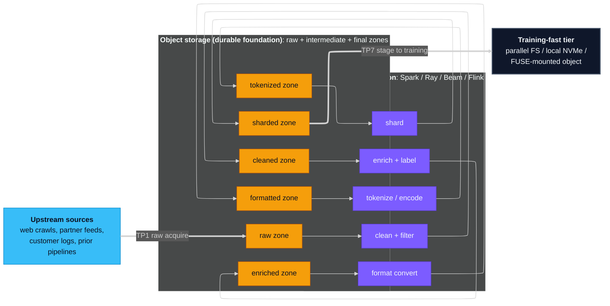
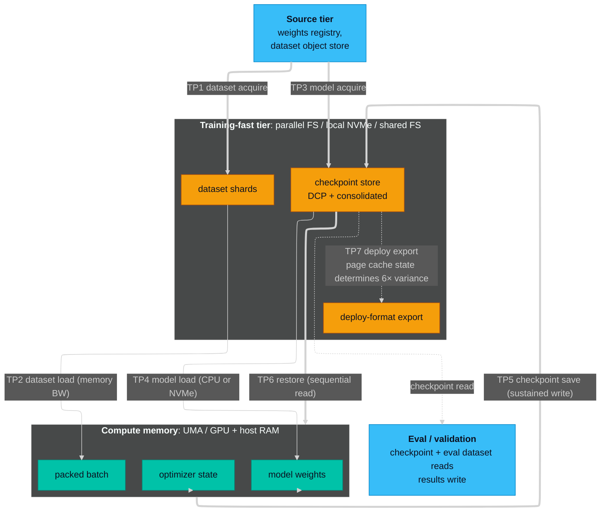
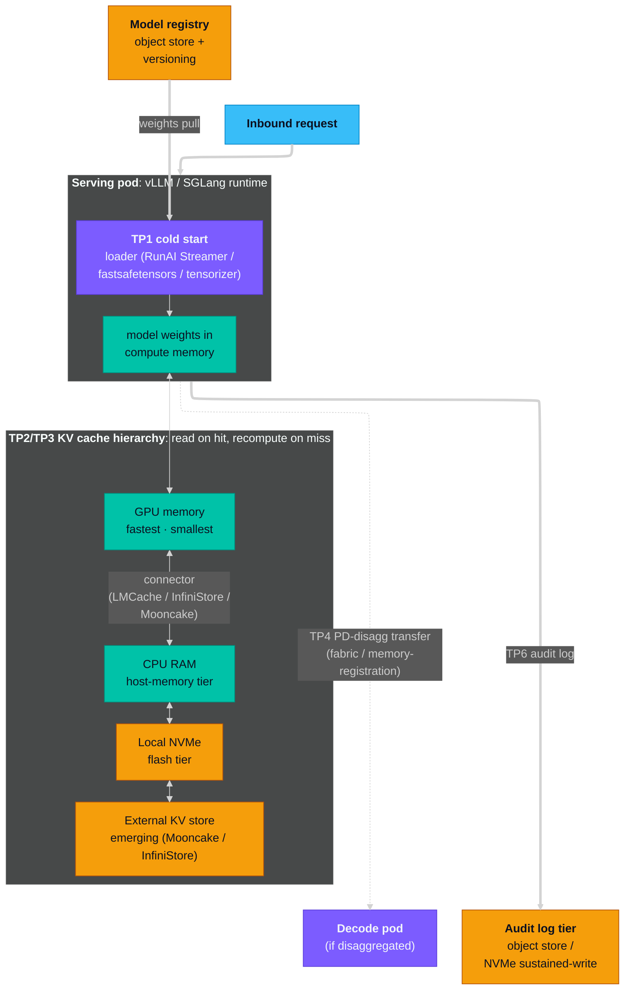

# Storage Touch Points Across the AI Pipeline

## TL;DR

Storage is usually not your bottleneck. Most of the time the GPU or the network is. But when storage does take over, it eats more wall-clock than the GPU does, and you pay for it in **idle accelerator capacity**, the most expensive line in any AI infrastructure budget. The gap between the obvious choice and the right one runs from a few times to tens of times across the touch points this lab has measured: see the [NVMe baseline](../../data-prep/spark-nvme-fio-baseline/spark-nvme-fio-baseline.md), the [full-SFT touch points](../../training/full-sft-storage-touchpoints/full-sft-storage-touchpoints.md), and the [vLLM cold load](../../inference/vllm-cold-load-loader-bound/vllm-cold-load-loader-bound.md).

**Where storage dominates:**

- **Data prep:** write-heavy; aggregate worker throughput, metadata service, and **capacity / cost-tier management at petabyte scale** set the ceiling.
- **Training:** storage dominates in four regimes: memory-constrained platforms, high-cadence checkpointing, multi-node with sync taxes, and large-context fine-tuning.
- **Inference:** dominates at cold start (loader choice beats tier choice), KV cache offload, prefill/decode KV transfer, and audit-log volume.

**Where storage stays quiet** (the part vendor content won't write honestly, but a practitioner can): small in-RAM datasets in prep, full-precision training on a healthy parallel FS, and steady-state serving of a hot model. Each stage section carries the full honest list.

The same touch points exist on cloud, on-prem, and lab. Vendors compete on how they implement each one, not on whether it exists. Pick tiers by measuring your workload's actual access pattern, not by inheriting defaults.

## Contents

- [The pipeline at a glance](#the-pipeline-at-a-glance)
- [Stage 1 — Data preparation](#stage-1--data-preparation)
- [Stage 2 — Training / fine-tuning](#stage-2--training--fine-tuning)
- [Stage 3 — Inference / serving](#stage-3--inference--serving)
- [Cross-cutting concerns](#cross-cutting-concerns)
- [Storage protocols and interfaces](#storage-protocols-and-interfaces)
- [Where to go next](#where-to-go-next)

## Orientation

**For AI infrastructure engineers** planning AI workloads at production scale, on-prem, cloud, or a serious workstation lab. Not for ML researchers, and not a training tutorial. It walks the decision tree you face when storage is in your portfolio: which tier for which phase, how to size each one, where the bottleneck actually lives, and what it costs when you get it wrong. Each stage gives you what it does, the storage aspects that matter, a touch-point table, and an honest note on when storage is *not* the bottleneck.

Every framing either links to a measured AIHomeLab artifact or carries a *descriptive only* tag, and the framings are anchored to industry references ([MLPerf Storage](https://mlcommons.org/benchmarks/storage/), [NVIDIA DGX SuperPOD](https://docs.nvidia.com/dgx-superpod/reference-architecture-scalable-infrastructure-h100/latest/storage-architecture.html), [Google Cloud AI/ML storage](https://docs.cloud.google.com/architecture/ai-ml/storage-for-ai-ml), [NVIDIA GPU Direct Storage](https://docs.nvidia.com/gpudirect-storage/overview-guide/index.html)) rather than lab knowledge alone. Measured rows use a small unified-memory cluster as the worked platform, but the touch-point shapes are platform-independent; platform-sensitive findings (UMA vs discrete VRAM, consumer NVMe vs enterprise NVMe vs parallel FS) are called out inline. The **LLM application pipeline** (RAG, agents, vector stores, prompt caches, conversation memory) is a separate guide. See [scope-and-caveats.md](../../scope-and-caveats.md) for what bounds the measured rows.

## The pipeline at a glance

The pipeline has three stages with distinct storage profiles: **data preparation** (turn raw material into a tokenized, sharded dataset), **training / fine-tuning** (stream the dataset, update weights, checkpoint, restore), and **inference / serving** (load the model, answer requests). Each has its own working set, dominant access pattern, and cache-eviction coupling; the next three sections walk them in order.

*Three stages, with a representative subset of touch points (each stage's full set is in its table). Color encodes the dominant resource: **orange** = storage I/O, **purple** = CPU, **teal** = memory bandwidth, **blue** = network. Solid arrows = primary flow within a stage; dotted arrows = side flows (eval reads off the checkpoint trail; PD-disaggregation transfer is conditional on serving topology). Thick arrows between stages mark the data handoffs that bridge the storage tiers.*

Diagram source (Mermaid)

```mermaid
%%{init: {'theme':'dark', 'flowchart': {'defaultRenderer': 'elk'}}}%%
flowchart LR
    classDef storage    fill:#F59E0B,stroke:#B45309,color:#0B1020,stroke-width:1px
    classDef compute    fill:#7C5CFF,stroke:#5B3DD9,color:#F1F5F9,stroke-width:1px
    classDef fabric     fill:#38BDF8,stroke:#0284C7,color:#0B1020,stroke-width:1px
    classDef memory     fill:#00C2A8,stroke:#008F7E,color:#0B1020,stroke-width:1px
    classDef stage      fill:#0F172A,stroke:#475569,color:#F1F5F9,stroke-width:2px

    subgraph DP["<b>Stage 1 · Data Preparation</b>"]
        direction TB
        DP1["<b>Raw acquire</b><br>network ingest"]:::fabric
        DP2["<b>Tokenize / encode</b><br>CPU + writes"]:::compute
        DP3["<b>Sharding</b><br>metadata + writes"]:::storage
        DP4["<b>Stage to training</b><br>egress + ingest"]:::fabric
        DP1 --> DP2 --> DP3 --> DP4
    end

    subgraph TR["<b>Stage 2 · Training / Fine-tuning</b>"]
        direction TB
        TR1["<b>Dataset stream</b><br>sequential read"]:::storage
        TR2["<b>Model load</b><br>CPU or NVMe"]:::compute
        TR3["<b>Checkpoint save</b><br>sustained write"]:::storage
        TR4["<b>Checkpoint restore</b><br>sequential read"]:::storage
        TR5["<b>Eval read</b><br>checkpoint + dataset"]:::memory
        TR1 --> TR2 --> TR3
        TR3 --> TR4
        TR3 -.-> TR5
    end

    subgraph IN["<b>Stage 3 · Inference / Serving</b>"]
        direction TB
        IN1["<b>Cold start</b><br>loader-bound"]:::compute
        IN2["<b>KV cache tiers</b><br>GPU mem → RAM → NVMe → ext"]:::memory
        IN3["<b>PD-disagg transfer</b><br>fabric"]:::fabric
        IN4["<b>Audit log</b><br>sustained write"]:::storage
        IN1 --> IN2
        IN2 -.-> IN3
        IN2 --> IN4
    end

    DP4 ==>|"sharded dataset"| TR1
    TR4 ==>|"trained checkpoint"| IN1

    class DP,TR,IN stage
```

To re-render after editing: `npx -y @mermaid-js/mermaid-cli -i pipeline.mmd -o pipeline.svg -t dark -b transparent`

---

## Stage 1 — Data preparation

*Multi-pass write pattern through object-store zones. Each transformation worker reads from one zone and writes to the next; raw data passes through several intermediate forms before reaching the training-fast tier. The final shape (TP6 sharding + TP7 stage-to-training) determines downstream training read efficiency.*

Diagram source (Mermaid)

To re-render after editing: `npx -y @mermaid-js/mermaid-cli -i data-prep.mmd -o data-prep.svg -t dark -b transparent`

### What this stage is

Data prep turns raw heterogeneous material (web crawls, customer logs, multimodal corpora, partner feeds) into a curated, tokenized, sharded dataset the training loop can stream. Data engineers do most of the work, running distributed jobs (Spark, Ray, Beam, Flink) over a durable storage foundation. The dominant pattern today is object storage (S3, GCS, Azure Blob, MinIO, on-prem equivalents); HDFS still anchors a large installed base in Hadoop-ecosystem deployments and behaves similarly for the framings below. Every clean / filter / dedup / enrich pass writes a new intermediate before the final shards land. The file format, shard size, and physical layout chosen here set the upper bound on training read throughput. No training-tier upgrade recovers what this stage gets wrong.

### Storage-relevant aspects that matter here

| Aspect | What matters here |
|---|---|
| **I/O pattern** | Write-heavy and multi-pass. Each transform reads the prior stage and writes a new intermediate, so a full pipeline rewrites the dataset 5–10× before final shards land. Sequential reads within a stage; aggregate writes from many workers. |
| **Capacity** | Three numbers, not one: the within-run working set runs 2–10× the final dataset (intermediates kept for restart), final output is what training plans against, and cumulative growth is what you budget for the year. The cumulative number is the one most often under-budgeted. |
| **Cost-tier management** | At dataset scale, storage is one of your biggest budget lines, so picking tiers and setting lifecycle rules is real work. Object tiers (hot / nearline / cold / archive) differ about 10× in price, and cross-region egress can cost more than the storage itself at PB scale. Tuning cost here usually pays back more than tuning throughput, and it is lower-risk. |
| **Throughput** | Aggregate write bandwidth across many workers, not single-stream peak. One executor at 200 MB/s is unremarkable; 500 aggregated is a different storage problem. |
| **Locality** | Two tiers in tension: object storage as the durable, region-redundant foundation, and a compute-attached fast tier (parallel FS, NVMe POSIX, FUSE-accelerated object) for the active transform window. Moving between them (egress, staging, cache warm-up) costs both wall-clock and bill. |
| **Concurrency** | Runtimes launch hundreds to thousands of workers. You need storage that scales linearly with reader/writer count; a per-job throughput ceiling caps you before compute saturates. |
| **Metadata** | Tokenized text and per-image-annotation sets can mean billions of small files, so file-create/list/stat rate hits the metadata service before raw bandwidth does. Container formats (TFRecord, webdataset) contain it; per-sample files amplify it. |
| **Durability** | Raw inputs and final outputs must survive crashes; they are hard or impossible to regenerate. Intermediates usually can be regenerated, so some pipelines route them to cheaper, lower-durability tiers. |

**Format note.** Format choice is a data prep decision that propagates downstream. Sequential-streaming formats (TFRecord, webdataset, MDS) pack many samples per container file and match the training loader's "stream N samples in order" pattern (webdataset and MDS also support shuffled sample access; TFRecord is sequential-only). Columnar formats (Parquet, Arrow) match the data-prep-side filter/project/aggregate pattern but are less efficient for sequential training reads. Multidimensional array formats (Zarr, HDF5, NetCDF) are the right shape for video, climate, and embedding datasets where the natural access pattern is reading a hyperslab of a giant N-D array. Multimodal workloads often need different formats per modality with the loader stitching them at training time. The decision sits in data prep; the consequence lands at training TP2.

### Touch points

| # | Touch point | Reads | Writes | What dominates | Anchor |
|---|---|---|---|---|---|
| 1 | **Raw acquire:** pull source material (partner feed, crawl, logs, public sets, prior runs) into the raw zone | upstream feed / crawl | object store (raw) | network ingress + object-store write bandwidth | *descriptive only* |
| 2 | **Cleaning + filtering:** quality filters, dedup, schema checks; each pass reads the full corpus, writes a filtered copy | object store (raw) | object store (cleaned) | concurrent write throughput; filter-logic CPU | *descriptive only* |
| 3 | **Enrichment:** annotations, labels, embeddings, metadata indices; may call a separate model | object store (cleaned) ± model | object store (enriched) | enrichment-model CPU/GPU; network if the model is remote | *descriptive only* |
| 4 | **Format conversion:** re-encode records into the format the training loader expects | object store (enriched) | object store (formatted) | concurrent write throughput; serialization CPU | *descriptive only* |
| 5 | **Tokenization / encoding:** turn records into the tensor-ready representation the model consumes | object store (formatted) | object store (tokenized) | per-worker CPU (often single-threaded); scales with worker count | *descriptive only* |
| 6 | **Sharding:** pack the dataset into fixed-size container files matched to the loader's prefetch budget; shard count is also the distribution unit across ranks | object store (tokenized) | object store (sharded) | aggregate write throughput; **metadata service for file-create rate** | *descriptive only* |
| 7 | **Stage to training tier:** copy or mount the prepared dataset where the training loop reads it; the handoff into training | object store (sharded) | training-fast tier | object-store egress; training-tier ingest rate | *descriptive only* |

### When storage is **not** the dominant concern in this stage

Data prep is storage-heavy by I/O volume but the *bottleneck* depends on which step you measure. Source small enough for single-node RAM (under ~100 GB): the whole pipeline runs in-memory, storage barely shows up. CPU-intensive transforms (heavy NLP cleaning, model-based embedding generation, complex regex) saturate compute before storage. Rate-limited upstream feeds (API quota, partner SLA, crawl politeness) cap the whole pipeline at ingress regardless of downstream write throughput. Pattern to watch: a job spending more time in worker CPU than waiting on storage means scale compute, not storage.

---

## Stage 2 — Training / fine-tuning

*Compute memory at center; the training-fast tier wraps it; the source tier (weights registry + dataset object store) seeds it. Bold arrows mark the sustained-throughput touch points (TP5 save, TP6 restore); the dotted TP7 export arrow is coupled to TP5's output through the page cache. Eval / validation branches off the checkpoint trail.*

Diagram source (Mermaid)

To re-render after editing: `npx -y @mermaid-js/mermaid-cli -i training.mmd -o training.svg -t dark -b transparent`

### What this stage is

Training feeds the prepared dataset through the model many times, updating model weights toward a loss objective. The shape varies dramatically by sub-regime, and an AI infrastructure engineer needs to know which one is being planned for:

- **Pre-training from scratch.** Multi-TB to multi-PB datasets; hundreds to thousands of GPUs; weeks to months of wall-clock. Dataset shuffling at scale is its own engineering problem: a multi-PB dataset can't fit in any single node's memory, so pre-shuffled sharded layouts or streaming-shuffle approaches are the actual options. Checkpoint cadence is infrequent (every hundreds of steps) but each checkpoint itself is multi-TB. MLPerf Storage v2.0 added a dedicated checkpointing workload (8B to 1T scenarios, save and load) as a separate test from sustained training reads.
- **Supervised fine-tuning (SFT, LoRA, QLoRA).** Hundreds of GB to a few TB of dataset; single-node to small-cluster (8–64 GPUs); days of wall-clock. Checkpoint cadence is per-hundred-steps. This is what most enterprise teams actually run, and what AIHomeLab's measured artifacts characterize end-to-end.
- **Post-training alignment (RLHF, DPO, GRPO, RLAIF).** Smaller datasets than SFT, but with a critical added cost: an inference path runs *inside* the training loop for reward modeling or policy comparison. Two models can be resident in compute memory simultaneously. The storage profile blends training writes with serving-style reads against a reference checkpoint.

All three sub-regimes share the core loop: a long-running process holds model state in compute memory, streams batches from storage, computes gradients, updates weights, periodically writes a checkpoint for crash resume. Storage shows up at seven specific points; which dominates wall-clock depends on the sub-regime.

### Storage-relevant aspects that matter here

| Aspect | What matters here |
|---|---|
| **I/O pattern** | Read-heavy during epochs (sequential dataset streaming, often shuffled), write-heavy during checkpoint cadence (multi-GB to multi-TB bursts by model size). Asymmetric across the run. |
| **Capacity** | Dominated by model + optimizer state + retained checkpoints. A full-SFT checkpoint bundles a sharded distributed-checkpoint form, a consolidated deploy format, and optimizer state, several times the parameter-only size, and retention stacks it. Worked example: an 8B full-SFT checkpoint lands around 62 GB; 70B+ pre-training checkpoints run to multiple TB per save. |
| **Throughput** | Sustained write rate during checkpoint save sets the cadence trade-off. Every tier has a burst-vs-sustained gap (consumer NVMe SLC fall-off, enterprise NVMe steady-state, shared-FS write-cache exhaustion, object-store rate limits), so size against the sustained number, not the advertised burst (see the [NVMe baseline](../../data-prep/spark-nvme-fio-baseline/spark-nvme-fio-baseline.md)). At production scale, NVIDIA's [DGX SuperPOD H100 architecture](https://docs.nvidia.com/dgx-superpod/reference-architecture-scalable-infrastructure-h100/latest/storage-architecture.html) targets a ~40 GB/s GDS read floor per node, with an ~80 GB/s aspirational target for the most demanding workloads, delivered over the SuperPOD storage fabric (RDMA-capable, converged Ethernet by default) and read into GPU memory via GPUDirect Storage. Useful planning anchors. |
| **Locality** | Single-node training is local-NVMe-only. Multi-node adds a coordination axis: a shared filesystem (parallel FS, NFS variant) or an external sync layer (rsync, object-store stage) to gather per-rank shards (see [multi-node training storage](../../training/multi-node-training-storage/multi-node-training-storage.md)). NVIDIA's SuperPOD certified-storage roster (DDN, IBM Storage Scale, NetApp, Pure FlashBlade, WekaFS, VAST, Dell PowerScale, and others) is a working list of production-grade options. |
| **Concurrency** | Page cache is the OS's scratch RAM for recently-read and recently-written file blocks. Every touch point on a node fights over the same pool: a heavy checkpoint write evicts the dataset pages the next epoch was counting on. This coupling is the most-mis-modeled part of training storage. |
| **Durability** | Checkpoints must survive crashes; the dataset cache can be regenerated from the prepared source. The two tiers can carry different durability requirements. |

**Distributed parallelism strategy.** The strategy the training team picks determines the storage access pattern more than any other architectural decision. The rule of thumb: bigger models use more complex strategies, and more complex strategies make checkpoint topology a first-class storage concern.

| Strategy | Storage access pattern |
|---|---|
| **Data parallel (DP)** | Every rank reads the same shards, different micro-batches. Dataset replicated or sharded; checkpoints written by rank 0 or every rank, depending on framework. |
| **Fully sharded data parallel (FSDP / ZeRO)** | Weights, gradients, and optimizer state sharded across ranks. Per-shard checkpoints: smaller per rank, larger in aggregate. |
| **Tensor parallel (TP)** | Weights sharded across ranks in a node group. Per-rank checkpoint shards; resharding needed to serve at a different TP degree. |
| **Pipeline parallel (PP)** | Model split across rank groups. Activation checkpointing adds its own storage cost during training. |
| **3D parallelism (TP × PP × DP)** | Common at 70B+. Checkpoint topology gets genuinely complex; restore needs the correct rank-to-shard mapping. |

### Touch points

| # | Touch point | Reads | Writes | What dominates | Anchor |
|---|---|---|---|---|---|
| 1 | **Dataset acquire:** pull the prepared dataset from the upstream registry / object store into the local cache | upstream registry / object store | local NVMe cache | network bandwidth (first run only; cached after) | *descriptive only* |
| 2 | **Dataset load + packing:** read cached shards and pack sequences into batches each epoch | NVMe (cached) | RAM (packed sequences) | memory bandwidth (per epoch) | *descriptive only* |
| 3 | **Model acquire:** pull base weights from the registry into the local cache | weights registry | local NVMe cache | network bandwidth, xet / S3 / GCS protocol (first run only) | [full-SFT touch points](../../training/full-sft-storage-touchpoints/full-sft-storage-touchpoints.md) |
| 4 | **Model load into compute:** deserialize cached weights into CPU/GPU memory at job start | NVMe → CPU/GPU memory | n/a | CPU tensor deserialization or NVMe read, depending on page-cache state | [full-SFT touch points](../../training/full-sft-storage-touchpoints/full-sft-storage-touchpoints.md) |
| 5 | **Checkpoint save:** write model + optimizer state from compute memory on the checkpoint cadence | compute memory | local storage / shared FS (sharded + consolidated) | sustained write rate of the tier; the just-written shard usually stays in page cache, setting up TP7 | [full-SFT touch points](../../training/full-sft-storage-touchpoints/full-sft-storage-touchpoints.md) + [NVMe baseline](../../data-prep/spark-nvme-fio-baseline/spark-nvme-fio-baseline.md) |
| 6 | **Checkpoint restore:** read a checkpoint back into compute memory on crash resume | NVMe (cold) | UMA / GPU memory | sequential read ceiling for the file format; loader pattern matters more than tier | [full-SFT touch points](../../training/full-sft-storage-touchpoints/full-sft-storage-touchpoints.md) |
| 7 | **Deploy-format export:** re-read the sharded checkpoint and write a consolidated deploy format | NVMe (re-read DCP shard) | NVMe (consolidated safetensors) | page-cache state of TP5's output: **6× wall-clock variance** depending on whether it is still resident (lab's 8B worked example) | [full-SFT touch points](../../training/full-sft-storage-touchpoints/full-sft-storage-touchpoints.md) |

**Cross-cutting in this stage:** touch points 5, 6, and 7 are coupled through the page cache. The same workload on the same hardware shows up to 6× difference in wall-clock for TP7 depending on whether TP5's output is still resident. Capacity planning for this stage should size the page-cache budget alongside the NVMe budget.

**Multi-node note:** at scale, touch point 5 acquires a new dimension: per-rank singleton coordination (the `LATEST` symlink, optimizer scheduler state), which surfaces an implicit shared-FS assumption in some frameworks. See [multi-node training storage](../../training/multi-node-training-storage/multi-node-training-storage.md) for the worked example.

### When storage is **not** the dominant concern in this stage

Most full-precision training on dGPU clusters with healthy parallel FS: **GPU is the bottleneck.** Datasets fit comfortably relative to GPU bandwidth, checkpoints amortize, the storage tier is over-provisioned by design. Storage takes over in four regimes: (a) memory-constrained platforms (UMA / unified-memory, undersized cloud VMs, noisy multi-tenant nodes), where page cache competes with the model's working set; (b) high-cadence checkpointing where write throughput caps training throughput; (c) multi-node training where shared-FS sync taxes per checkpoint; (d) large-context fine-tuning where dataset working sets approach or exceed RAM and the loader goes I/O-bound every epoch. If none of these apply, storage isn't your problem.

### Eval / validation as an adjacent sub-concern

Eval / validation reads a trained checkpoint, runs benchmark suites (MMLU, GSM8K, HumanEval, MT-Bench, domain-specific evals) or safety evals, writes results. Two patterns: **continuous evals during training** (held-out batches between steps, used as a continue/stop signal) and **discrete post-training evals** (full suite run on a deployment-candidate checkpoint). Storage profile: read-heavy on checkpoint + eval dataset, write-light on results. Rarely the bottleneck: eval is typically inference-compute-bound or judge-bound. Two reasons AI infra engineers plan around it anyway: deployment sign-offs and compliance attestations land on eval results (so the results tier needs durability + retention), and **versioned, immutable eval datasets** (shared across many runs, content-addressed for reproducibility) are a storage requirement that doesn't show up elsewhere.

---

## Stage 3 — Inference / serving

*Cold start (TP1) flows from model registry through a chosen loader into compute memory. KV cache (TP2/TP3) tiers across GPU memory, CPU RAM, local NVMe, and external storage, bridged by framework-agnostic connectors. The dotted TP4 transfer to a decode pod activates only in PD-disaggregation topologies. TP6 audit log is the sustained-write workload that dominates fleet storage at production scale.*

Diagram source (Mermaid)

To re-render after editing: `npx -y @mermaid-js/mermaid-cli -i inference.mmd -o inference.svg -t dark -b transparent`

### What this stage is

Inference serves a trained model: a deployed runtime receives requests, runs them through the model, returns tokens. Two upstream choices shape the serving storage profile more than any tier choice. **Model architecture:** quantization level (4/8/16-bit) sets weight footprint and load time; dense vs mixture-of-experts (MoE) decides which weights need to be hot at any moment; transformer variant determines KV-cache growth per token. **Serving framework + topology:** vLLM and SGLang are the dominant open-source runtimes; both shape how weights are loaded, how the KV cache is managed, how requests are batched. A newer pattern, **prefill/decode (PD) disaggregation**, splits request handling across two pods: a *prefill* pod that does the heavy initial pass (compute-bound), and a *decode* pod that streams the token-by-token response (memory-bandwidth-bound). The KV cache prefill builds has to move to decode over the network, a path that doesn't exist in monolithic single-pod serving.

Scope: this section covers **model serving as the endpoint of the development pipeline** (load weights, accept requests, generate output, log). RAG, agents, vector stores, prompt orchestration, and conversation memory belong to the **LLM application pipeline** (separate guide).

### Storage-relevant aspects that matter here

| Concern | What matters |
|---|---|
| **Cold-start latency** | Whether weights are resident at pod start sets time-to-first-served-request. At scale (autoscaling pools, spot-instance recovery, multi-model serving) cold starts happen often enough that load latency becomes a service-quality SLO. On-prem typically pre-stages weights on local NVMe per node; cloud increasingly uses purpose-built tiers like [Google Cloud Hyperdisk ML](https://docs.cloud.google.com/architecture/ai-ml/storage-for-ai-ml), a read-only volume attachable to thousands of nodes at once for sharing weights at fleet scale. |
| **Loader choice often beats the storage tier** | If your model loads slowly, the tier is usually not the problem. The default safetensors loader moves weights sequentially on a single thread (read to CPU, then copy to GPU), so a faster disk does not help; a loader that parallelizes reads and overlaps the host-to-GPU copy does. In this lab, swapping to a streaming loader (Run:ai Model Streamer, fastsafetensors) cut cold load 14–36× with no tier change ([vLLM cold load](../../inference/vllm-cold-load-loader-bound/vllm-cold-load-loader-bound.md)). The caveat: once the fast loader removes the CPU wall it reads near the NVMe ceiling, so on a slower tier the tier becomes the next bottleneck. Some clouds now ship serving-tuned FUSE adapters for this (e.g., GKE Cloud Storage FUSE serving profile with Rapid Cache). |
| **KV cache as a tiered hierarchy** | With longer contexts and growing token reuse, the KV cache is itself a major working set. Deployments tier it across GPU memory (fastest, smallest), CPU RAM (roughly 10× more capacity, ~10× lower bandwidth, worse tail latency, since PCIe round-trips are not free), and local NVMe (another ~10× capacity, reads in tens of microseconds). An emerging fourth tier, external KV stores like Mooncake Store and InfiniStore, handles the longest tail at frontier labs; most deployments stop at NVMe. Hit rate at each tier sets GPU utilization and per-request throughput. |
| **KV cache connectors** | Framework-agnostic connectors bridge the runtime to storage tiers, handling offload and prefetch. LMCache is a widely-adopted open-source connector across vLLM and SGLang. Major labs have released their own backends (InfiniStore from ByteDance, Mooncake Store from Moonshot AI), usually tuned to their stack. The pattern matters more than the implementation: a connector that supports your framework plus your tier removes the bespoke-glue burden. |
| **PD-disaggregation transfer path** | When prefill and decode split across pods, the KV from prefill must reach decode. **This is fabric, not storage:** in production it is an RDMA-class network with user-space memory registration (UCX, NIXL, RoCEv2), not a file or object store. It is here because it sits on the model's data path, flagged so a storage-side reader does not go hunting for a file layer. Its bandwidth and memory-registration model set how far disaggregation scales, and add failure modes (registration backends, fabric mismatches) that monolithic serving does not have. |
| **Audit log write rate** | Request/response logs at full fidelity can match or exceed the model weight footprint per million requests, depending on response length and retention: chatty long-form workloads blow past it, short-output APIs with aggressive retention may never come close. This is the most-frequently-mis-sized touch point in serving; planning often assumes "small text" and lands on undersized log tiers that throttle live traffic. |
| **Image / serving-artifact registry** | Container image pulls at cold start can dominate time-to-readiness if registry bandwidth is constrained; once node-cached, irrelevant for later starts on the same node. |

### Touch points

| # | Touch point | Reads | Writes | What dominates | Anchor |
|---|---|---|---|---|---|
| 1 | **Model load (cold start):** weights move from durable storage into compute memory at pod start | durable storage (object / NVMe / shared FS) | n/a | **loader choice** more than storage tier: the default safetensors loader is single-thread-CPU-bound, so a streaming loader cuts cold load 14–36× with no tier change. Once loaded, weights stay resident. | [vLLM cold load](../../inference/vllm-cold-load-loader-bound/vllm-cold-load-loader-bound.md) |
| 2 | **KV cache placement:** the runtime structure that grows with context length and request count; GPU memory by default, tiered to RAM / NVMe / external via connectors | n/a | GPU memory / CPU RAM / NVMe / external (tiered) | GPU memory bandwidth at the top tier; cross-tier transfer rate when offloading. Grows live, per token. | *descriptive only* |
| 3 | **Prefix / prompt cache:** computed KV for repeated prompt prefixes; RAM-resident with TTL or LRU eviction | RAM / GPU memory | n/a | memory bandwidth on hit; recompute cost on miss. Bounded by TTL or capacity. | *descriptive only* |
| 4 | **PD-disagg transfer (fabric, not storage):** in prefill/decode disaggregation, KV from the prefill pod transits to the decode pod | KV from prefill pod | KV to decode pod | network bandwidth (RDMA-class fabric in production) and the memory-registration model; on the model's data path, not a storage operation (see the aspect note) | *descriptive only* |
| 5 | **Serving artifact cache:** compiled kernels, tokenizer assets, runtime config, container image | container registry + NVMe | n/a | network egress (image pull) on first deploy; cached once per node after | *descriptive only* |
| 6 | **Trace + audit log:** request/response logging at production scale | n/a | NVMe / object store | sustained write rate; volume planning at fleet scale (write-through, no caching) | *descriptive only* |
| 7 | **Model swap / hot reload:** multi-model serving swaps weights across NVMe ↔ GPU at runtime | NVMe → GPU memory | n/a | same as TP1, plus request-drain constraints; depends on swap policy and traffic shape | *descriptive only* |

### When storage is **not** the dominant concern in this stage

Steady-state serving on healthy infra with a hot model: **storage isn't the bottleneck.** GPU compute (per-token throughput) and network egress (response streaming) dominate. Storage takes over in four regimes: (a) **cold start at scale:** autoscaling, spot-instance recovery, multi-model serving make cold starts frequent enough that load latency is a service SLO; (b) **long-context / high-reuse:** KV cache grows to where multi-tier offload management is the rate-determining step; (c) **PD disaggregation:** the prefill-to-decode KV transfer path becomes a network-or-storage bottleneck; (d) **audit-log-heavy compliance regimes:** retained logs at full fidelity dominate fleet-wide storage volume. If none of these apply, storage is not slowing you down.

---

## Cross-cutting concerns

These mechanics show up in every stage. Worth pulling out of the per-stage tables.

**Cost of getting it wrong.** Storage has a lopsided cost shape. Get it right and it stays invisible, which is the goal at every stage. Get it wrong and you pay in **idle accelerator capacity**: GPUs stalling on dataset reads, training blocked on slow checkpoint writes, serving pods cold-starting one at a time while traffic queues, prefill pods waiting on KV transfers from disaggregated decode pods. In the worst case slow becomes failure: I/O queues overflow, checkpoint timeouts crash the job, pods OOM under KV pressure. Accelerators are the most expensive thing you own, so even a small storage tax compounds at scale. That asymmetry is the whole reason for the framings here: cold vs warm, what dominates, the per-stage honesty boxes.

**Cold vs warm.** The single most useful framing question for any touch point is whether the page cache, prefix cache, or GPU memory cache will already be populated when the work happens. The lab's measured artifacts all separate cold and warm columns because mixing them inflates published numbers by 5–20×. Apply the same discipline when you read someone else's number.

**Page cache state as a coupling mechanism.** Page cache is shared across all touch points on a node. A heavy write at one touch point evicts the dataset another touch point expects to find resident. This shows up most painfully in training's checkpoint cadence trade-off (see [full-SFT touch points](../../training/full-sft-storage-touchpoints/full-sft-storage-touchpoints.md)).

**Single-node vs distributed.** Distributed adds two storage axes: per-rank symmetry (does each rank need an identical view, or only a sharded view?) and shared-FS taxes (the price you pay per checkpoint for not having a sync layer at the end). The [multi-node training storage](../../training/multi-node-training-storage/multi-node-training-storage.md) artifact walks one worked example of the trade-off.

**Spec sheet vs ML-effective.** Every storage tier has a spec sheet number (vendor PDF), a synthetic-burst number (60-second FIO), a sustained number (post-SLC for NVMe, post-cache for shared FS), and an ML-effective number (what the workload's actual access pattern gets). The gaps stack multiplicatively. See the [NVMe baseline](../../data-prep/spark-nvme-fio-baseline/spark-nvme-fio-baseline.md) for one worked decomposition (22× total gap, three components).

**GPU Direct Storage (GDS).** NVIDIA's [GPU Direct Storage](https://docs.nvidia.com/gpudirect-storage/overview-guide/index.html) lets GPUs read directly from NVMe or RDMA storage, bypassing the CPU bounce buffer. When enabled, it changes the "what dominates" answer for several touch points (dataset stream during training, model load at cold start, checkpoint restore) by removing CPU and host-RAM bandwidth from the data path. Requires GDS-enabled drivers + an integrated storage layer; supported on local XFS / EXT4 with O_DIRECT and on a list of RDMA-capable distributed filesystems (DDN ExaScaler, BeeGFS, IBM Spectrum Scale, NetApp ONTAP, WekaFS, VAST NFS, Amazon FSx for Lustre among others). For AI infrastructure engineers planning storage on NVIDIA GPUs, GDS support is a real selection criterion for the storage tier, not a nice-to-have.

**Model registry and artifact promotion.** Between training-end and inference-start sits a model registry (MLflow, Weights & Biases, HuggingFace Hub, internal artifact stores) that handles long-term retention, version management, and deployment-tier promotion. From a storage perspective: this is a low-volume, high-durability, indefinite-retention store with strong metadata requirements (model versioning, lineage, eval results attached). Often the same object-store substrate as the rest of the pipeline, but with stricter access controls and longer retention policies.

## Storage protocols and interfaces

The touch-point map is interface-agnostic: the same touch points exist across cloud, on-prem, and lab. What changes per environment is the protocol the workload speaks to storage, so the actual decision an AI infra engineer makes is which interface to expose for each tier in each stage. The families below are the menu; the per-stage sketch after them is where to start.

Protocol and interface families (reference list)

- **POSIX parallel filesystems:** Lustre, IBM Spectrum Scale (formerly GPFS), BeeGFS, WekaFS, DAOS. Used for high-throughput training reads + checkpoint writes at scale. This is the protocol family where most of the NVIDIA SuperPOD certified storage sits (roster named once in the training stage above).
- **NFS variants:** NFSv3, NFSv4, NFS-over-RDMA. Common in enterprise on-prem; used for shared FS during multi-node training when full parallel FS isn't justified. The lab measured a worked example in [multi-node training storage](../../training/multi-node-training-storage/multi-node-training-storage.md).
- **Object storage (native API):** S3, GCS, Azure Blob, on-prem (MinIO, Ceph RGW, Cloudian). The durable foundation for raw datasets, final shards, model registry. High capacity, lower per-op throughput than POSIX.
- **FUSE adapters over object:** Cloud Storage FUSE (GCS), Mountpoint S3, s3fs, JuiceFS. Mount object storage as a POSIX-looking filesystem; performance depends on the adapter's caching layer.
- **File-over-object:** offerings (WekaFS S3, VAST, NetApp ONTAP S3, MinIO Gateway) that present object storage with file-class performance via internal caching and metadata acceleration.
- **Cloud-managed AI-specific tiers:** Google Cloud Hyperdisk ML (read-only-many for serving), Google Cloud Managed Lustre (parallel FS for training), AWS FSx for Lustre, Azure NetApp Files / Managed Lustre. Purpose-built for specific touch points rather than general purpose.
- **GPU Direct Storage** (cross-cutting): applies on top of several of the above; see the cross-cutting concern.

Per-stage typical interface choices, **starting points to investigate, not destinations**. The patterns below match how production deployments most commonly look today; they are not endorsements, and the "typical" choice is not always the right one once a specific workload is measured. The lab's [multi-node training storage](../../training/multi-node-training-storage/multi-node-training-storage.md) artifact is a concrete cautionary example: the obvious choice (NFS-over-RDMA) turned out to be 13% *slower* than NFS-over-TCP for writes in the sync-export regime. Use the sketch below as a place to start narrowing the search, then measure against your actual workload before committing:

- **Data prep:** object storage as durable foundation; compute-attached fast tier (parallel FS or FUSE-with-cache) for the active transform window. Versioned eval datasets typically land on the same object-store substrate with stricter retention.
- **Training:** parallel FS (on-prem) or cloud-managed parallel FS (cloud) or local NVMe + sync layer (smaller clusters). The actual decision turns on number of ranks, per-rank sustained bandwidth requirement, checkpoint topology, and whether GPU Direct Storage is in play.
- **Inference:** model registry on object storage; serving-side weights on local NVMe (per-node) or a fleet-wide shared tier like Hyperdisk ML's READ_ONLY_MANY pattern; audit-log tier on object storage with sustained-write provisioning sized to the request-volume forecast.

## Where to go next

### Lab-measured artifacts (anchored to AIHomeLab experiments)

- **Want to baseline an NVMe device for AI workloads** → [Spark NVMe FIO baseline](../../data-prep/spark-nvme-fio-baseline/spark-nvme-fio-baseline.md). The kit runs on any single NVMe.
- **Want to characterize the training stage touch points end-to-end** → [full-SFT storage touch points](../../training/full-sft-storage-touchpoints/full-sft-storage-touchpoints.md). Worked example on Qwen3-8B at fine-tuning scale.
- **Want to choose between local-NVMe + sync layer vs shared FS for multi-node** → [multi-node training storage](../../training/multi-node-training-storage/multi-node-training-storage.md). Three-way comparison + decision heuristic.
- **Want to stand up shared FS on a small cluster** → [Lustre on UMA workstations](../../training/lustre-on-uma-workstations/lustre-on-uma-workstations.md). Six-obstacle build cascade + load-bearing knob trio.
- **Want to know why a slow vLLM cold load is the loader's fault, not the tier's** → [vLLM cold load is loader-bound](../../inference/vllm-cold-load-loader-bound/vllm-cold-load-loader-bound.md). Default safetensors pins one CPU core; streaming loaders cut cold load 14–36× with no tier change.

### Industry-standard references (external)

- **Want to compare storage systems for AI in a vendor-neutral way** → [MLPerf Storage benchmark](https://mlcommons.org/benchmarks/storage/). Architecture-neutral; v2.0 added multi-TB checkpoint workloads on top of sustained training reads.
- **Want NVIDIA's production reference architecture at scale** → [DGX SuperPOD storage architecture](https://docs.nvidia.com/dgx-superpod/reference-architecture-scalable-infrastructure-h100/latest/storage-architecture.html). Throughput requirements per accelerator node + certified storage roster.
- **Want a major cloud's published guidance for AI/ML storage tiering** → [Design storage for AI and ML workloads in Google Cloud](https://docs.cloud.google.com/architecture/ai-ml/storage-for-ai-ml). Per-phase tier recommendations + the GKE Cloud Storage FUSE serving / checkpointing profile distinction.
- **Want to evaluate GPU Direct Storage support across filesystems** → [NVIDIA GPUDirect Storage Overview Guide](https://docs.nvidia.com/gpudirect-storage/overview-guide/index.html). Supported filesystem list + cuFile / cuObject API model.

## Bounds

This is a framing artifact, not a measurement artifact. Rows tagged *descriptive only* reflect a storage-practitioner read combined with patterns from the industry references cited inline; they are not backed by AIHomeLab measurements. Rows with internal links are backed by the numbers in that artifact, bounded by [scope-and-caveats.md](../../scope-and-caveats.md).

What this guide deliberately does *not* yet do: walk pre-training-scale workloads in worked-example detail (the lab measures fine-tuning, not pre-training); decompose multimodal-specific patterns beyond a brief mention; enumerate vendor-specific products beyond the references already cited. The LLM application pipeline (RAG, agents, vector stores, prompt caches, conversation memory) is **out of scope**: different storage shape, separate concept guide.
