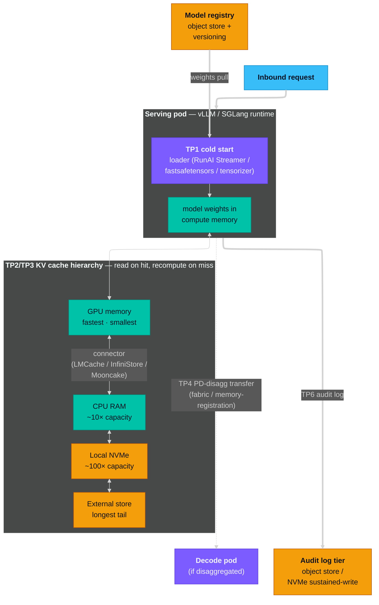

# Storage Touch Points Across the AI Pipeline

**Date:** 2026-05-23 · **Author:** Kumar Nachiketa · **Scope:** the LLM development pipeline — data prep → training / fine-tuning (with eval / validation) → inference

## TL;DR

Storage shows up at distinct, predictable touch points across the LLM development pipeline. Most of the time it isn't the bottleneck — GPU or network is. But when storage *does* dominate, it dominates wall-clock more than the GPU does, and the gap between "obvious choice" and "right choice" can be 5–20×.

- **Data prep** — write-heavy; aggregate worker throughput and metadata service set the ceiling. Shifts to CPU on heavy transforms, to ingress on rate-limited sources.
- **Training** — compute-bound on healthy infra. Storage dominates in four regimes: memory-constrained platforms, high-cadence checkpointing, multi-node with sync taxes, large-context fine-tuning.
- **Inference** — storage-quiet at steady state. Dominates at cold start (loader choice beats tier choice), KV cache offload, PD-disagg KV transfer, and audit-log volume.

The same touch points exist on cloud, on-prem, and lab. Vendors compete on how they implement each one — not on whether the touch point exists. Pick tiers by measuring your workload's actual access pattern, not by inheriting defaults.

## Orientation

**For storage and infrastructure architects** planning AI workloads at production scale — on-prem, cloud, serious workstation labs. Not for ML researchers; not a tutorial on training. The framings target the decision tree a storage architect walks: which tier for which phase, how to size each one, where the bottleneck actually lives.

Each stage opens with what it does, then storage-relevant aspects (I/O, capacity, throughput, locality, concurrency, durability), a touch-point table (*what is read · what is written · what is cached · what dominates*), and an honest note about when storage is **not** the dominant concern. Rows either link to a measured AIHomeLab artifact or carry an explicit *descriptive only* tag. Framings are anchored to industry references — [MLPerf Storage](https://mlcommons.org/benchmarks/storage/), [NVIDIA DGX SuperPOD](https://docs.nvidia.com/dgx-superpod/reference-architecture-scalable-infrastructure-h100/latest/storage-architecture.html), [Google Cloud AI/ML storage](https://docs.cloud.google.com/architecture/ai-ml/storage-for-ai-ml), [NVIDIA GPU Direct Storage](https://docs.nvidia.com/gpudirect-storage/overview-guide/index.html) — rather than lab knowledge alone.

The framings apply across on-prem, cloud, and lab. Measured rows use a small unified-memory cluster as the worked platform, but the touch-point shapes are platform-independent; where a finding is platform-sensitive (UMA vs discrete-VRAM, consumer NVMe vs enterprise NVMe vs parallel FS), it's called out inline. The **LLM application pipeline** (RAG, agents, vector stores, prompt caches, conversation memory) has a different storage shape and is a separate guide. See [scope-and-caveats.md](../../scope-and-caveats.md) for what bounds the measured rows.

## The pipeline at a glance

The LLM development pipeline has three stages with distinct storage profiles:

1. **Data preparation** — turn raw source material into a curated, tokenized, sharded dataset the training loop can stream through.
2. **Training / fine-tuning** — feed the prepared dataset through the model, update weights, periodically write checkpoints, restore on failure. Includes pre-training (scratch), supervised fine-tuning (SFT, LoRA, QLoRA), and post-training alignment (RLHF, DPO, GRPO) — three sub-regimes with different storage shapes. Eval / validation runs alongside this stage (treated as a sub-concern below) — read-heavy, write-light, rarely storage-bound, but architects plan around it because that's where deployment sign-offs land.
3. **Inference / serving** — load the trained model into a serving runtime and respond to requests.

Each stage has its own working set, dominant access pattern, and "what gets cached, what gets evicted" coupling. The next three sections walk them in order.

*Three stages, twelve representative touch points. Color encodes the dominant resource: **orange** = storage I/O, **purple** = CPU, **teal** = memory bandwidth, **blue** = network. Solid arrows = primary flow within a stage; dotted arrows = side flows (eval reads off the checkpoint trail; PD-disaggregation transfer is conditional on serving topology). Thick arrows between stages mark the data handoffs that bridge the storage tiers.*

```mermaid
%%{init: {'theme':'dark', 'flowchart': {'defaultRenderer': 'elk'}}}%%
flowchart LR
    classDef storage    fill:#F59E0B,stroke:#B45309,color:#0B1020,stroke-width:1px
    classDef compute    fill:#7C5CFF,stroke:#5B3DD9,color:#F1F5F9,stroke-width:1px
    classDef fabric     fill:#38BDF8,stroke:#0284C7,color:#0B1020,stroke-width:1px
    classDef memory     fill:#00C2A8,stroke:#008F7E,color:#0B1020,stroke-width:1px
    classDef stage      fill:#0F172A,stroke:#475569,color:#F1F5F9,stroke-width:2px

    subgraph DP["<b>Stage 1 · Data Preparation</b>"]
        direction TB
        DP1["<b>Raw acquire</b><br>network ingest"]:::fabric
        DP2["<b>Tokenize / encode</b><br>CPU + writes"]:::compute
        DP3["<b>Sharding</b><br>metadata + writes"]:::storage
        DP4["<b>Stage to training</b><br>egress + ingest"]:::fabric
        DP1 --> DP2 --> DP3 --> DP4
    end

    subgraph TR["<b>Stage 2 · Training / Fine-tuning</b>"]
        direction TB
        TR1["<b>Dataset stream</b><br>sequential read"]:::storage
        TR2["<b>Model load</b><br>CPU or NVMe"]:::compute
        TR3["<b>Checkpoint save</b><br>sustained write"]:::storage
        TR4["<b>Checkpoint restore</b><br>sequential read"]:::storage
        TR5["<b>Eval read</b><br>checkpoint + dataset"]:::memory
        TR1 --> TR2 --> TR3
        TR3 --> TR4
        TR3 -.-> TR5
    end

    subgraph IN["<b>Stage 3 · Inference / Serving</b>"]
        direction TB
        IN1["<b>Cold start</b><br>loader-bound"]:::compute
        IN2["<b>KV cache tiers</b><br>GPU mem → RAM → NVMe → ext"]:::memory
        IN3["<b>PD-disagg transfer</b><br>fabric"]:::fabric
        IN4["<b>Audit log</b><br>sustained write"]:::storage
        IN1 --> IN2
        IN2 -.-> IN3
        IN2 --> IN4
    end

    DP4 ==>|"sharded dataset"| TR1
    TR4 ==>|"trained checkpoint"| IN1

    class DP,TR,IN stage
```

Diagram source (Mermaid)

To re-render after editing: `npx -y @mermaid-js/mermaid-cli -i pipeline.mmd -o pipeline.svg -t dark -b transparent`

---

## Stage 1 — Data preparation

*Multi-pass write pattern through object-store zones. Each transformation worker reads from one zone and writes to the next; raw data passes through several intermediate forms before reaching the training-fast tier. The final shape (TP6 sharding + TP7 stage-to-training) determines downstream training read efficiency.*

Diagram source (Mermaid)

To re-render after editing: `npx -y @mermaid-js/mermaid-cli -i data-prep.mmd -o data-prep.svg -t dark -b transparent`

### What this stage is

Data prep turns raw heterogeneous material — web crawls, customer logs, multimodal corpora, partner feeds — into a curated, tokenized, sharded dataset the training loop can stream. Data engineers do most of the work, running distributed jobs (Spark, Ray, Beam, Flink) over an object-store foundation (S3, GCS, Azure Blob, MinIO, on-prem equivalents). Every clean / filter / dedup / enrich pass writes a new intermediate before the final shards land. The file format, shard size, and physical layout chosen here set the upper bound on training read throughput — no training-tier upgrade recovers what this stage gets wrong.

### Storage-relevant aspects that matter here

- **I/O pattern.** Write-heavy and multi-pass. Each transformation stage reads the previous stage's output and writes a new intermediate; a typical end-to-end pipeline rewrites the dataset 5–10 times before the final shards land. Reads are largely sequential within a stage; writes are aggregate from hundreds or thousands of parallel workers.
- **Capacity.** The working set during an active pipeline run typically reaches 2–10× the final dataset size, because each transform-and-write step keeps prior intermediates around for restart-on-failure. Final-output capacity is what training plans against; pipeline-run capacity is what data prep plans against — and the second number is the one most often under-budgeted.
- **Throughput.** Aggregate write bandwidth across many concurrent workers, not single-stream peak. A single executor writing at 200 MB/s is unremarkable; 500 executors aggregated is a fundamentally different storage problem.
- **Locality.** Two tiers in tension. Object storage is the durable foundation — cost-effective, region-redundant, the place raw and final datasets live long-term. A compute-attached fast tier (parallel filesystem, NVMe-backed POSIX, FUSE-accelerated object) is used for the active transformation window where read-write-read patterns happen at low latency. The transition cost between tiers (egress, staging, cache warm-up) shows up in both pipeline wall-clock and bill.
- **Concurrency.** Distributed transformation runtimes launch hundreds to thousands of parallel workers. Storage that scales linearly with reader/writer count is the requirement; storage with a per-job throughput ceiling becomes the bottleneck before the compute layer is saturated.
- **Metadata performance.** Tokenized text and per-image-annotation datasets can produce billions of small files. The file-create/list/stat rate against the storage tier's metadata service often becomes the bottleneck before raw bandwidth ever does. Format and shard-size choices either contain this (large container files like TFRecord/webdataset that pack thousands of samples per file) or amplify it (per-sample files).
- **Durability.** Raw inputs and final outputs must survive crashes — they're hard or impossible to regenerate. Intermediates are typically regeneratable from an earlier stage; some pipelines deliberately route intermediate state to lower-durability/higher-throughput tiers to save cost.

**Format note.** Format choice is a data prep decision that propagates downstream. Sequential-streaming formats (TFRecord, webdataset, MDS) pack many samples per container file and match the training loader's "stream N samples in order" pattern. Columnar formats (Parquet, Arrow) match the data-prep-side filter/project/aggregate pattern but are less efficient for sequential training reads. Multidimensional array formats (Zarr, HDF5, NetCDF) are the right shape for video, climate, and embedding datasets where the natural access pattern is reading a hyperslab of a giant N-D array. Multimodal workloads often need different formats per modality with the loader stitching them at training time. The decision sits in data prep; the consequence lands at training TP2.

### Touch points

1. **Raw acquire** — ingest source material from upstream (partner feed, web crawl, customer log, public dataset, prior pipeline run) into the object-store foundation.
2. **Cleaning + filtering** — quality filters (length, language, PII scrub), exact and near-duplicate detection, schema enforcement. Each pass reads the full corpus and writes a filtered copy.
3. **Enrichment** — annotations, labels, embeddings, metadata indices. Adds dimensions to existing records; may invoke a separate model or human-in-the-loop step.
4. **Format conversion** — re-encode records into the format the training loader expects.
5. **Tokenization / modality encoding** — turn human-readable records into the tensor-ready representation the model consumes (text tokenization; image/audio/video preprocessing).
6. **Sharding** — split the tokenized/encoded dataset into fixed-size container files matched to the training loader's prefetch budget. Shard count is also the natural unit of distribution across training ranks.
7. **Stage-to-training-tier** — copy or mount the prepared dataset onto where the training loop will read from (local NVMe per training node, parallel FS, or FUSE-mounted object). The interface between this stage and training.

| # | Touch point | What is read | What is written | What is cached | What dominates | Anchor |
|---|---|---|---|---|---|---|
| 1 | Raw acquire | upstream feed / partner / crawl | object store (raw zone) | first run only | network ingress + object-store write bandwidth | *descriptive only — not measured in this lab* |
| 2 | Cleaning + filtering | object store (raw) | object store (cleaned) | runtime-dependent (worker RAM caches hot partitions) | concurrent write throughput from distributed workers; CPU for filter logic | *descriptive only — not measured in this lab* |
| 3 | Enrichment | object store (cleaned) ± external model | object store (enriched) | model weights resident in worker memory if model-based | CPU/GPU for enrichment model; network if model is remote | *descriptive only — not measured in this lab* |
| 4 | Format conversion | object store (enriched) | object store (formatted) | streaming buffers in worker memory | concurrent write throughput; some CPU for serialization | *descriptive only — not measured in this lab* |
| 5 | Tokenization / encoding | object store (formatted) | object store (tokenized) | tokenizer / encoder in worker memory | CPU (often single-threaded per worker); aggregate throughput depends on worker count | *descriptive only — not measured in this lab* |
| 6 | Sharding | object store (tokenized) | object store (sharded) | streaming buffers | aggregate write throughput; **metadata service for file-create rate** | *descriptive only — not measured in this lab* |
| 7 | Stage-to-training-tier | object store (sharded) | training-fast tier (parallel FS / local NVMe / FUSE mount) | tier-dependent | egress bandwidth from object store; ingest rate of training-fast tier | *descriptive only — not measured in this lab* |

### When storage is **not** the dominant concern in this stage

Data prep is storage-heavy by I/O volume but the *bottleneck* depends on which step you measure. Source small enough for single-node RAM (under ~100 GB): the whole pipeline runs in-memory, storage barely shows up. CPU-intensive transforms — heavy NLP cleaning, model-based embedding generation, complex regex — saturate compute before storage. Rate-limited upstream feeds (API quota, partner SLA, crawl politeness) cap the whole pipeline at ingress regardless of downstream write throughput. Pattern to watch: a job spending more time in worker CPU than waiting on storage means scale compute, not storage.

---

## Stage 2 — Training / fine-tuning

*Compute memory at center; training-fast tier wraps it; the source tier (weights registry + dataset object store) seeds it. Bold arrows mark the sustained-throughput touch points (TP5 checkpoint save, TP6 restore). The dotted TP7 export arrow is coupled to TP5's output through the page cache — the mechanism behind the 6× wall-clock variance documented in [008](../../training/full-sft-storage-touchpoints/full-sft-storage-touchpoints.md). Eval / validation branches off the checkpoint trail.*

Diagram source (Mermaid)

To re-render after editing: `npx -y @mermaid-js/mermaid-cli -i training.mmd -o training.svg -t dark -b transparent`

### What this stage is

Training feeds the prepared dataset through the model many times, updating model weights toward a loss objective. The shape varies dramatically by sub-regime, and a storage architect needs to know which one is being planned for:

- **Pre-training from scratch.** Multi-TB to multi-PB datasets; hundreds to thousands of GPUs; weeks to months of wall-clock. Dataset shuffling at scale is its own engineering problem — a multi-PB dataset can't fit in any single node's memory, so pre-shuffled sharded layouts or streaming-shuffle approaches are the actual options. Checkpoint cadence is infrequent (every hundreds of steps) but each checkpoint itself is multi-TB. The MLPerf Storage v2.0 benchmark specifically targets this regime's checkpointing workload as a separate test from sustained training reads.
- **Supervised fine-tuning (SFT, LoRA, QLoRA).** Hundreds of GB to a few TB of dataset; single-node to small-cluster (8–64 GPUs); days of wall-clock. Checkpoint cadence is per-hundred-steps. This is what most enterprise teams actually run, and what AIHomeLab's measured artifacts characterize end-to-end.
- **Post-training alignment (RLHF, DPO, GRPO, RLAIF).** Smaller datasets than SFT, but with a critical added cost: an inference path runs *inside* the training loop for reward modeling or policy comparison. Two models can be resident in compute memory simultaneously. The storage profile blends training writes with serving-style reads against a reference checkpoint.

All three sub-regimes share the core loop: a long-running process holds model state in compute memory, streams batches from storage, computes gradients, updates weights, periodically writes a checkpoint for crash resume. Storage shows up at seven specific points; which dominates wall-clock depends on the sub-regime.

### Storage-relevant aspects that matter here

- **I/O pattern.** Read-heavy during epochs (sequential dataset streaming, often shuffled), write-heavy during checkpoint cadence (large multi-GB to multi-TB bursts depending on model size). Asymmetric across the run lifecycle.
- **Capacity.** Dominated by model + optimizer state + retained checkpoints. A full-SFT checkpoint typically bundles a sharded distributed-checkpoint form, a consolidated deploy format, and optimizer state — several times the parameter-only size. Retention policy stacks this. As a worked example, an 8B full-SFT checkpoint in the lab's measurements lands around 62 GB; pre-training checkpoints at 70B+ run into multiple TB per save.
- **Throughput.** Sustained write rate during checkpoint save is the rate-determining step for cadence trade-offs. Burst-vs-sustained gaps exist in every storage tier (consumer NVMe SLC fall-off, enterprise NVMe steady-state limits, shared-FS write-cache exhaustion, cloud object store rate limits) — size against the sustained number for your tier, not the advertised burst — see [007](../../data-prep/spark-nvme-fio-baseline/spark-nvme-fio-baseline.md) for one decomposition of these gaps on a consumer Gen5 NVMe. At production scale, [NVIDIA's DGX SuperPOD reference architecture](https://docs.nvidia.com/dgx-superpod/reference-architecture-scalable-infrastructure-h100/latest/storage-architecture.html) requires sustained single-node storage bandwidth of **at least 40 GB/s per H200 node** and targets close to **80 GB/s per H100 node** delivered over InfiniBand RDMA — useful anchor numbers for planning against.
- **Distributed parallelism strategy.** The parallelism strategy the training team chooses determines the storage access pattern more than any other architectural decision:
  - **Data parallel (DP)** — every rank reads the same shards, different micro-batches. Dataset replicated or sharded across ranks; checkpoints written by rank 0 or every rank depending on framework.
  - **Fully sharded data parallel (FSDP / ZeRO)** — weights, gradients, and optimizer state sharded across ranks. Per-shard checkpoints; smaller per rank, larger in aggregate.
  - **Tensor parallel (TP)** — model weights sharded across ranks within a node group. Per-rank checkpoint shards; resharding required when serving at a different TP degree.
  - **Pipeline parallel (PP)** — model split across rank groups. Activation checkpointing adds its own storage cost during training.
  - **3D parallelism (TP × PP × DP)** — common at 70B+. Checkpoint topology gets genuinely complex; restore requires the correct rank-to-shard mapping.
  - Each strategy creates a different checkpoint topology and a different dataset read pattern. Architects sizing storage for pre-training-scale jobs should know which strategy is planned before specifying tiers.
- **Locality.** Single-node training is local-NVMe-only. Multi-node training adds a coordination axis: either a shared filesystem (parallel FS, NFS variant) or an external sync layer (rsync, object-store stage) to gather per-rank shards. See [013](../../training/multi-node-training-storage/multi-node-training-storage.md) for a three-way comparison. NVIDIA's SuperPOD certified storage roster — DDN, IBM Storage Scale, NetApp E-Series/BeeGFS + ONTAP, Pure FlashBlade, WekaFS, VAST — gives a working list of production-grade options at scale.
- **Concurrency.** Page cache is a shared resource across touch points; heavy writes at checkpoint save evict the dataset pages the next epoch expects to find resident. This coupling is the most-mis-modeled aspect of training storage.
- **Durability.** Checkpoints must survive crashes; the dataset cache can be regenerated from the prepared source. The two tiers can have different durability requirements.

### Touch points

| # | Touch point | What is read | What is written | What is cached | What dominates | Anchor |
|---|---|---|---|---|---|---|
| 1 | Dataset acquire | upstream registry / object store | local NVMe cache | first-run only | network bandwidth | [008](../../training/full-sft-storage-touchpoints/full-sft-storage-touchpoints.md) |
| 2 | Dataset load + packing | NVMe (cached path) | RAM (packed sequences) | per-epoch | memory bandwidth | [008](../../training/full-sft-storage-touchpoints/full-sft-storage-touchpoints.md) |
| 3 | Model acquire | weights registry | local NVMe cache | first-run only | network bandwidth (xet / S3 / GCS protocol) | [008](../../training/full-sft-storage-touchpoints/full-sft-storage-touchpoints.md) |
| 4 | Model load into compute | NVMe → CPU/GPU memory | — | three regimes (page-cache-served / partial / cold-cache) | CPU decode OR NVMe read depending on regime | [008](../../training/full-sft-storage-touchpoints/full-sft-storage-touchpoints.md) |
| 5 | Checkpoint save | compute memory | local storage / shared FS (sharded + consolidated formats) | the just-written shard often stays in page cache for TP7 | sustained write rate of the storage tier | [008](../../training/full-sft-storage-touchpoints/full-sft-storage-touchpoints.md) + [007](../../data-prep/spark-nvme-fio-baseline/spark-nvme-fio-baseline.md) |
| 6 | Checkpoint restore | NVMe (cold) | UMA / GPU memory | loader pattern matters more than tier choice | sequential read ceiling for the file format | [008](../../training/full-sft-storage-touchpoints/full-sft-storage-touchpoints.md) |
| 7 | Deploy-format export | NVMe (re-read DCP shard) | NVMe (consolidated safetensors) | **6× wall-clock variance based on page cache state at the time of export** | page cache state of TP5's output | [008](../../training/full-sft-storage-touchpoints/full-sft-storage-touchpoints.md) |

**Cross-cutting in this stage:** touch points 5, 6, and 7 are coupled through the page cache. The same workload on the same hardware shows up to 6× difference in wall-clock for TP7 depending on whether TP5's output is still resident. Capacity planning for this stage should size the page-cache budget alongside the NVMe budget.

**Multi-node note:** at scale, touch point 5 acquires a new dimension — per-rank singleton coordination (the `LATEST` symlink, optimizer scheduler state) — that surfaces an implicit shared-FS assumption in some frameworks. See [multi-node training storage](../../training/multi-node-training-storage/multi-node-training-storage.md) for the worked example.

### When storage is **not** the dominant concern in this stage

Most full-precision training on dGPU clusters with healthy parallel FS: **GPU is the bottleneck.** Datasets fit comfortably relative to GPU bandwidth, checkpoints amortize, the storage tier is over-provisioned by design. Storage takes over in four regimes: (a) memory-constrained platforms — UMA / unified-memory, undersized cloud VMs, noisy multi-tenant nodes — where page cache competes with the model's working set; (b) high-cadence checkpointing where write throughput caps training tps; (c) multi-node training where shared-FS sync taxes per checkpoint; (d) large-context fine-tuning where dataset working sets approach or exceed RAM and the loader goes I/O-bound every epoch. None of these → storage isn't the problem.

### Eval / validation as an adjacent sub-concern

Eval / validation reads a trained checkpoint, runs benchmark suites (MMLU, GSM8K, HumanEval, MT-Bench, domain-specific evals) or safety evals, writes results. Two patterns: **continuous evals during training** (held-out batches between steps, used as a continue/stop signal) and **discrete post-training evals** (full suite run on a deployment-candidate checkpoint). Storage profile: read-heavy on checkpoint + eval dataset, write-light on results. Rarely the bottleneck — eval is typically inference-compute-bound or judge-bound. Two reasons architects plan around it anyway: deployment sign-offs and compliance attestations land on eval results (so the results tier needs durability + retention), and **versioned, immutable eval datasets** — shared across many runs, content-addressed for reproducibility — are a storage requirement that doesn't show up elsewhere.

---

## Stage 3 — Inference / serving

*Cold start (TP1) flows from model registry through a chosen loader into compute memory. KV cache (TP2/TP3) tiers across GPU memory, CPU RAM, local NVMe, and external storage — bridged by framework-agnostic connectors. The dotted TP4 transfer to a decode pod activates only in PD-disaggregation topologies. TP6 audit log is the sustained-write workload that dominates fleet storage at production scale.*

Diagram source (Mermaid)

To re-render after editing: `npx -y @mermaid-js/mermaid-cli -i inference.mmd -o inference.svg -t dark -b transparent`

### What this stage is

Inference serves a trained model: a deployed runtime receives requests, runs them through the model, returns tokens. Two upstream choices shape the serving storage profile more than any tier choice. **Model architecture** — quantization level (4/8/16-bit) sets weight footprint and load time; dense vs mixture-of-experts (MoE) decides which weights need to be hot at any moment; transformer variant determines KV-cache growth per token. **Serving framework + topology** — vLLM and SGLang are the dominant open-source runtimes; both shape how weights are loaded, how the KV cache is managed, how requests are batched. The newer pattern, **prefill/decode (PD) disaggregation**, splits the compute-heavy initial pass (prefill) from the memory-bandwidth-bound autoregressive generation (decode) across pods — and creates a new storage/network path for KV transfer that doesn't exist in monolithic serving.

Scope: this section covers **model serving as the endpoint of the development pipeline** — load weights, accept requests, generate output, log. RAG, agents, vector stores, prompt orchestration, and conversation memory belong to the **LLM application pipeline** (separate guide).

### Storage-relevant aspects that matter here

- **Cold-start latency.** Weights residency at the moment of pod start determines time-to-first-served-request. At scale — autoscaling pools, spot-instance recovery, multi-model serving — cold starts happen often enough that load latency becomes a service-quality SLO, not an afterthought. Production patterns vary by environment: on-prem typically pre-stages weights on local NVMe per node; cloud increasingly uses purpose-built tiers like [Google Cloud's Hyperdisk ML](https://docs.cloud.google.com/architecture/ai-ml/storage-for-ai-ml) (a single read-only volume attachable to thousands of nodes concurrently, designed specifically for sharing model weights at fleet scale).
- **Loader choice often dominates storage tier.** The default safetensors loader is often CPU-bound on per-tensor deserialization rather than storage-bound — a faster tier doesn't help past a point. Loaders like RunAI Streamer, fastsafetensors, and tensorizer can recover significant cold-load time by parallelizing decode or streaming weights directly to GPU memory. The loader-vs-tier decision is one of the most-mis-made choices in inference infrastructure planning. Some cloud platforms have begun shipping serving-specific FUSE adapters with caching tuned for this workload (e.g., GKE's Cloud Storage FUSE serving profile with Rapid Cache).
- **KV cache as a tiered hierarchy.** With growing context lengths and token reuse becoming common across use cases, KV cache itself is becoming a major working-set problem. Production deployments now tier KV across GPU memory (fastest, smallest), CPU RAM (~10× the capacity, ~10× the access latency), local NVMe (~100× the capacity, slower again), and external/remote storage for the longest-tail working sets. Cache hit rate at each tier determines GPU utilization and per-request throughput.
- **KV cache connectors.** Framework-agnostic connectors bridge inference frameworks to storage tiers, handling offload and prefetch. LMCache is a widely-adopted open-source connector that works across vLLM and SGLang. Major AI labs have released their own backends — InfiniStore from ByteDance, Mooncake Store from Moonshot AI — typically optimized for the specific framework + hardware in their production stack. The pattern matters more than any specific implementation: a connector that supports your framework + your storage tier eliminates the bespoke-glue burden.
- **PD-disaggregation transfer path.** When prefill and decode are split across pods, the KV from prefill must transit to decode over network or storage. The path's bandwidth and memory-registration model become rate-determining for how far disaggregation scales — and create a class of failure modes (memory-registration backends, fabric mismatches) that don't exist in monolithic serving.
- **Audit log write rate.** Request/response logs retained at full fidelity match or exceed the model weight footprint per million requests. The most-frequently-mis-sized touch point in serving — capacity planning often assumes "small text" and lands on undersized log tiers that throttle live traffic.
- **Image / serving-artifact registry.** Container image pulls at cold start can dominate time-to-readiness if registry bandwidth is constrained; once node-cached, irrelevant for subsequent starts on the same node.

### Touch points

1. **Model load (cold start)** — weights move from durable storage into compute memory at pod start. Loader choice (RunAI Streamer, fastsafetensors, tensorizer, vLLM default) often more determining than tier choice; default loaders can be CPU-bound at decode, not storage-bound.
2. **KV cache placement** — the runtime data structure that grows with context length and request count. Lives in GPU memory by default; tiered across CPU RAM, local NVMe, and external storage at production scale through KV-cache connectors.
3. **Prefix / prompt cache** — computed KV for repeated prompt prefixes; typically RAM-resident with TTL or LRU eviction. A specialization of KV cache with a different access pattern (read-mostly, warm-resident).
4. **PD-disaggregation transfer path** — in prefill/decode disaggregation, KV from the prefill pod must transit to the decode pod over network or storage. New in disaggregation topologies; absent in monolithic serving.
5. **Serving artifact cache** — compiled kernels, tokenizer assets, runtime config, container image; small footprint, accessed once per cold start per node.
6. **Trace + audit log** — request/response logging at production scale; often the largest sustained-write workload across the whole serving fleet.
7. **Model swap / hot reload** — multi-model serving may swap weights across NVMe ↔ GPU at runtime; reuses TP1 mechanics with the added constraint of draining in-flight requests on the outgoing model.

| # | Touch point | What is read | What is written | What is cached | What dominates | Anchor |
|---|---|---|---|---|---|---|
| 1 | Model load (cold start) | durable storage (object / NVMe / shared FS) | — | weights residency in compute memory | **loader choice** more than storage tier; default loader is often CPU-bound at decode | *descriptive only — not measured publicly in this lab* |
| 2 | KV cache placement | — | GPU memory / CPU RAM / NVMe / external (tiered) | live, growing per token | GPU memory bandwidth at top tier; cross-tier transfer rate when offloading | *descriptive only — not measured in this lab* |
| 3 | Prefix / prompt cache | RAM / GPU memory | — | TTL or capacity-bound | memory bandwidth on hit; recompute cost on miss | *descriptive only — not measured in this lab* |
| 4 | PD-disagg transfer | KV from prefill pod | KV to decode pod | KV in transit | network bandwidth (RDMA-class fabric in production); memory-registration model | *descriptive only — not measured publicly in this lab* |
| 5 | Serving artifact cache | container registry + NVMe | — | once per cold start per node | network egress (image pull) on first deploy | *descriptive only — not measured in this lab* |
| 6 | Trace + audit log | — | NVMe / object store | none (write-through) | sustained write rate; volume planning at fleet scale | *descriptive only — not measured in this lab* |
| 7 | Model swap / hot reload | NVMe → GPU memory | — | depends on swap policy + traffic shape | same as TP1, plus request-drain constraints | *descriptive only — not measured in this lab* |

### When storage is **not** the dominant concern in this stage

Steady-state serving on healthy infra with a hot model: **storage isn't the bottleneck.** GPU compute (per-token throughput) and network egress (response streaming) dominate. Storage takes over in four regimes: (a) **cold start at scale** — autoscaling, spot-instance recovery, multi-model serving make cold starts frequent enough that load latency is a service SLO; (b) **long-context / high-reuse** — KV cache grows to where multi-tier offload management is the rate-determining step; (c) **PD disaggregation** — the prefill-to-decode KV transfer path becomes a network-or-storage bottleneck; (d) **audit-log-heavy compliance regimes** — retained logs at full fidelity dominate fleet-wide storage volume. None of these → storage isn't slowing you down.

---

## Cross-cutting concerns

These mechanics show up in every stage. Worth pulling out of the per-stage tables.

**Cold vs warm.** The single most useful framing question for any touch point is whether the page cache, prefix cache, or GPU memory cache will already be populated when the work happens. The lab's measured artifacts all separate cold and warm columns because mixing them inflates published numbers by 5–20×. Apply the same discipline when you read someone else's number.

**Page cache state as a coupling mechanism.** Page cache is shared across all touch points on a node. A heavy write at one touch point evicts the dataset another touch point expects to find resident. This shows up most painfully in training's checkpoint cadence trade-off (see [008](../../training/full-sft-storage-touchpoints/full-sft-storage-touchpoints.md)).

**Single-node vs distributed.** Distributed adds two storage axes: per-rank symmetry (does each rank need an identical view, or only a sharded view?) and shared-FS taxes (the price you pay per checkpoint for not having a sync layer at the end). The [multi-node training storage](../../training/multi-node-training-storage/multi-node-training-storage.md) artifact walks one worked example of the trade-off.

**Spec sheet vs ML-effective.** Every storage tier has a spec sheet number (vendor PDF), a synthetic-burst number (60-second FIO), a sustained number (post-SLC for NVMe, post-cache for shared FS), and an ML-effective number (what the workload's actual access pattern gets). The gaps stack multiplicatively. See [007 NVMe baseline](../../data-prep/spark-nvme-fio-baseline/spark-nvme-fio-baseline.md) for one worked decomposition (22× total gap, three components).

**GPU Direct Storage (GDS).** NVIDIA's [GPU Direct Storage](https://docs.nvidia.com/gpudirect-storage/overview-guide/index.html) lets GPUs read directly from NVMe or RDMA storage, bypassing the CPU bounce buffer. When enabled, it changes the "what dominates" answer for several touch points (dataset stream during training, model load at cold start, checkpoint restore) by removing CPU and host-RAM bandwidth from the data path. Requires GDS-enabled drivers + an integrated storage layer; supported on local XFS / EXT4 with O_DIRECT and on a list of RDMA-capable distributed filesystems (DDN ExaScaler, BeeGFS, IBM Spectrum Scale, NetApp ONTAP, WekaFS, VAST NFS, Amazon FSx for Lustre among others). For architects sizing AI infrastructure on NVIDIA GPUs, GDS support is a real selection criterion for the storage tier, not a nice-to-have.

**Model registry and artifact promotion.** Between training-end and inference-start sits a model registry — MLflow, Weights & Biases, HuggingFace Hub, internal artifact stores — that handles long-term retention, version management, and deployment-tier promotion. From a storage perspective: this is a low-volume, high-durability, indefinite-retention store with strong metadata requirements (model versioning, lineage, eval results attached). Often the same object-store substrate as the rest of the pipeline, but with stricter access controls and longer retention policies.

## Storage protocols and interfaces

The touch-point map is interface-agnostic — the same touch points exist across cloud, on-prem, and lab. What changes per environment is the protocol the workload speaks to storage. A storage architect's actual decision is which interface to expose for each tier in each stage:

- **POSIX parallel filesystems** — Lustre, IBM Spectrum Scale (formerly GPFS), BeeGFS, WekaFS, DAOS. Used for high-throughput training reads + checkpoint writes at scale. Most NVIDIA SuperPOD certified storage offerings sit here.
- **NFS variants** — NFSv3, NFSv4, NFS-over-RDMA. Common in enterprise on-prem; used for shared FS during multi-node training when full parallel FS isn't justified. The lab measured a worked example in [013](../../training/multi-node-training-storage/multi-node-training-storage.md).
- **Object storage (native API)** — S3, GCS, Azure Blob, on-prem (MinIO, Ceph RGW, Cloudian). The durable foundation for raw datasets, final shards, model registry. High capacity, lower per-op throughput than POSIX.
- **FUSE adapters over object** — Cloud Storage FUSE (GCS), Mountpoint S3, s3fs, JuiceFS. Mount object storage as a POSIX-looking filesystem; performance depends on the adapter's caching layer.
- **File-over-object** — vendor offerings (WekaFS S3, VAST, NetApp ONTAP S3, MinIO Gateway) that present object storage with file-class performance via internal caching and metadata acceleration.
- **Cloud-managed AI-specific tiers** — Google Cloud Hyperdisk ML (read-only-many for serving), Google Cloud Managed Lustre (parallel FS for training), AWS FSx for Lustre, Azure NetApp Files / Managed Lustre. Purpose-built for specific touch points rather than general purpose.
- **GPU Direct Storage** (cross-cutting) — applies on top of several of the above; see the cross-cutting concern.

Per-stage typical interface choices — **starting points to investigate, not destinations**. The patterns below match how production deployments most commonly look today; they are not endorsements, and the "typical" choice is not always the right one once a specific workload is measured. The lab's [multi-node training storage](../../training/multi-node-training-storage/multi-node-training-storage.md) artifact is a concrete cautionary example — the obvious choice (NFS-over-RDMA) turned out to be 13% *slower* than NFS-over-TCP for writes in the sync-export regime. Use the sketch below as a place to start narrowing the search, then measure against your actual workload before committing:

- **Data prep:** object storage as durable foundation; compute-attached fast tier (parallel FS or FUSE-with-cache) for the active transform window. Versioned eval datasets typically land on the same object-store substrate with stricter retention.
- **Training:** parallel FS (on-prem) or cloud-managed parallel FS (cloud) or local NVMe + sync layer (smaller clusters). The actual decision turns on number of ranks, per-rank sustained bandwidth requirement, checkpoint topology, and whether GPU Direct Storage is in play.
- **Inference:** model registry on object storage; serving-side weights on local NVMe (per-node) or a fleet-wide shared tier like Hyperdisk ML's READ_ONLY_MANY pattern; audit-log tier on object storage with sustained-write provisioning sized to the request-volume forecast.

## Where to go next

### Lab-measured artifacts (anchored to AIHomeLab experiments)

- **Want to baseline an NVMe device for AI workloads** → [Spark NVMe FIO baseline](../../data-prep/spark-nvme-fio-baseline/spark-nvme-fio-baseline.md). The kit runs on any single NVMe.
- **Want to characterize the training stage touch points end-to-end** → [full-SFT storage touch points](../../training/full-sft-storage-touchpoints/full-sft-storage-touchpoints.md). Worked example on Qwen3-8B at fine-tuning scale.
- **Want to choose between local-NVMe + sync layer vs shared FS for multi-node** → [multi-node training storage](../../training/multi-node-training-storage/multi-node-training-storage.md). Three-way comparison + decision heuristic.
- **Want to stand up shared FS on a small cluster** → [Lustre on UMA workstations](../../training/lustre-on-uma-workstations/lustre-on-uma-workstations.md). Six-obstacle build cascade + load-bearing knob trio.

### Industry-standard references (external)

- **Want to compare storage systems for AI in a vendor-neutral way** → [MLPerf Storage benchmark](https://mlcommons.org/benchmarks/storage/). Architecture-neutral; v2.0 added multi-TB checkpoint workloads on top of sustained training reads.
- **Want NVIDIA's production reference architecture at scale** → [DGX SuperPOD storage architecture](https://docs.nvidia.com/dgx-superpod/reference-architecture-scalable-infrastructure-h100/latest/storage-architecture.html). Throughput requirements per accelerator node + certified storage roster.
- **Want a major cloud's published guidance for AI/ML storage tiering** → [Design storage for AI and ML workloads in Google Cloud](https://docs.cloud.google.com/architecture/ai-ml/storage-for-ai-ml). Per-phase tier recommendations + the GKE Cloud Storage FUSE serving / checkpointing profile distinction.
- **Want to evaluate GPU Direct Storage support across filesystems** → [NVIDIA GPUDirect Storage Overview Guide](https://docs.nvidia.com/gpudirect-storage/overview-guide/index.html). Supported filesystem list + cuFile / cuObject API model.

## Bounds

This is a framing artifact, not a measurement artifact. Rows tagged *descriptive only* reflect a storage-practitioner read combined with patterns from the industry references cited inline; they are not backed by AIHomeLab measurements. Rows with internal links are backed by the numbers in that artifact, bounded by [scope-and-caveats.md](../../scope-and-caveats.md).

What this guide deliberately does *not* yet do: walk pre-training-scale workloads in worked-example detail (the lab measures fine-tuning, not pre-training); decompose multimodal-specific patterns beyond a brief mention; enumerate vendor-specific products beyond the references already cited. The LLM application pipeline (RAG, agents, vector stores, prompt caches, conversation memory) is **out of scope** — different storage shape, separate concept guide.
