# Spark NVMe FIO Baseline — Reproduce Kit

Run this kit on any Linux box with a single NVMe to reproduce the 8-job FIO baseline that backs `../spark-nvme-fio-baseline.md`. ~30 min compute (8 × 180s) + ~3 min one-time testfile pre-allocation.

## Prerequisites

- Linux with `fio` (≥3.30), `jq`, `sysstat`, `sudo` for cache drop.
- An NVMe device with **≥2.2 TB free space** (the testfile is 2 TiB by design — see *Why so much disk* below).
- Test path `/home/sparks/fio-baseline-reproduce/` writable (or override `TEST_DIR=` at run time).

## Quick start

```bash
TEST_DIR=/your/nvme/path ./run-baseline.sh
```

The script pre-allocates the testfile (one-time), runs all 8 jobs in numeric order with a page-cache drop before each, and prints the Measured table at the end.

## How the kit fits together

```mermaid
%%{init: {'theme':'dark'}}%%
flowchart LR
    classDef compute    fill:#7C5CFF,stroke:#5B3DD9,color:#F1F5F9,stroke-width:1px
    classDef nvme       fill:#00C2A8,stroke:#008F7E,color:#0B1020,stroke-width:1px
    classDef cache      fill:#F2C744,stroke:#C99B0A,color:#0B1020,stroke-width:1px
    classDef cloud      fill:#3FA9F5,stroke:#1E7BC0,color:#0B1020,stroke-width:1px
    classDef checkpoint fill:#FF6B6B,stroke:#C13A3A,color:#0B1020,stroke-width:1px
    classDef container  fill:#94A3B8,stroke:#64748B,color:#0B1020,stroke-width:1px
    classDef fabric     fill:#1E293B,stroke:#64748B,color:#F1F5F9,stroke-width:1px,stroke-dasharray: 4 3

    JOBS["8 .fio job files<br/>(workload params)"]:::container
    ORCH["run-baseline.sh<br/>(orchestrator)"]:::container
    DRIVE["NVMe drive<br/>hot tier · ~2 TiB testfile"]:::nvme
    OUT["out/*.json<br/>(per-job results)"]:::container
    ANALYZE["analyze.sh<br/>(jq + spec compare)"]:::container
    TABLE["Measured table<br/>(% of spec)"]:::container
    IOSTAT["iostat -d 1 or -d 2<br/>(optional side-channel)"]:::fabric

    JOBS -->|read config| ORCH
    ORCH -->|drop cache, run FIO 180 s/job| DRIVE
    DRIVE -->|sustained I/O| OUT
    OUT -->|parse| ANALYZE
    ANALYZE -->|markdown| TABLE
    DRIVE -.->|optional, OS-level cross-check| IOSTAT
```



<details>
<summary>Diagram source (Mermaid)</summary>



To re-render after editing: `npx -y @mermaid-js/mermaid-cli -i <input.mmd> -o kit-structure.svg -t dark -b transparent`

</details>

The orchestrator drives FIO against the NVMe testfile using parameters from the `.fio` job files; per-job JSON output feeds the analyzer, which prints the Measured table. iostat is an optional OS-level side-channel for cross-validating FIO's reported numbers (see *What the iostat side-channel adds* below).

## What the 8 jobs measure

| File | Pattern | Why it matters |
| --- | --- | --- |
| `01-seqwrite-1t.fio` | seqwrite, 1 MB, 1 thread | Single-stream baseline (matches naive application loaders) |
| `02-seqwrite-16t.fio` | seqwrite, 1 MB, 16 threads | Multi-thread ceiling write — reveals SLC fall-off most sharply |
| `03-seqread-1t.fio` | seqread, 1 MB, 1 thread | Single-stream read baseline |
| `04-seqread-16t.fio` | seqread, 1 MB, 16 threads | Multi-thread ceiling read |
| `05-randread-4k-qd64.fio` | randread, 4k, QD64 | IOPS ceiling (dataset shards, metadata) |
| `06-randwrite-4k-qd64.fio` | randwrite, 4k, QD64 | IOPS ceiling write |
| `07-randread-4k-qd1.fio` | randread, 4k, QD1 | Latency floor (per-op p99) |
| `08-rw7030.fio` | mixed 70/30, 1 MB, 8 threads | Training proxy |

## FIO parameter rationale

Every job's `[global]` block uses these flags. Why each:

| Flag | Why |
| --- | --- |
| `ioengine=libaio` | Linux native async I/O. Realistic for production. |
| `direct=1` | Bypass kernel page cache. Measures the drive, not RAM. |
| `time_based=1` | Run for `runtime` seconds regardless of `size`. |
| `runtime=180` | Sustained measurement window. Crosses SLC boundary on most consumer Gen5 drives — that's intentional, see *Why 180 s*. |
| `ramp_time=10` | Discard first 10 s. Lets caches warm and FIO stat collection stabilize. |
| `end_fsync=1` | (write jobs) Flush before reporting; otherwise reported bw includes still-dirty buffer state. |
| `group_reporting=1` | Aggregate per-thread numbers into one report. |
| `size=2048g` | 2 TiB testfile, shared across all jobs. |
| `write_bw_log + log_avg_msec=1000` | (write jobs) per-second bandwidth log so you can plot the SLC fall-off curve. |

Per-job overrides:

| Flag | Why |
| --- | --- |
| `rw=...` | Workload pattern. |
| `bs=...` | Block size. 1 MB for sequential (matches typical loader chunk); 4k for random (matches OS page). |
| `numjobs=...` | Parallel threads. 1 for single-stream baselines, 16 for ceiling, 4 for IOPS, 8 for mixed. |
| `iodepth=...` | Async queue depth per thread. 1 for latency-sensitive; 64 for IOPS jobs. |
| `offset_increment=...` | (multi-thread jobs) Splits the testfile into per-thread regions. **Critical** — without it, multi-thread reads are cache-amplified by up to 16×. See *Two cache-amplification bugs*. |
| `rwmixread=70` | (mixed only) 70% reads, 30% writes. |

For deeper FIO semantics, see <https://fio.readthedocs.io/>.

## Why 180 s

Storage benchmarks shorter than ~60 s mostly measure SLC cache + DRAM absorption, not the drive. 60 s is enough to expose throttling on most consumer drives. **180 s is deliberately long enough to cross the SLC boundary** on consumer Gen5 NVMe (typical 4 TB consumer Gen5 drives have several hundred GB of SLC; at 11 GB/s × 180 s = 2 TB written, far exceeding most caches).

This means the 16-thread seqwrite number reported is a time-average of the SLC-burst rate and the post-SLC TLC sustained rate. **That is the intended measurement** — it's what a real AI training workload writing a multi-GB checkpoint will see. Specs typically quote the burst rate; this kit measures the sustained number.

The `write_bw_log` files let you plot the curve and see exactly when SLC fills.

## Why so much disk (2.2 TB)

`time_based=1` makes each thread loop within its file region until the runtime elapses. If the per-thread region is smaller than (runtime × per-thread bandwidth), the thread re-reads its own data on the second loop — and on Gen5 with a DRAM-backed drive, those re-reads come from the drive's onboard DRAM (4 GB on the 9100 PRO) at memory speed, not NAND. That inflates the reported bandwidth.

Per-thread budget: 180 s × ~700 MB/s (Gen5 per-thread real) = **~126 GB minimum region per thread**. With 16 threads → **2 TB minimum testfile**. The 2 TiB sizing here gives 128 GiB per thread — just enough no-wrap headroom.

If you reduce the testfile size, your read bandwidth numbers will be inflated. If you reduce runtime, you'll miss the SLC fall-off. The 30 min wall clock is the price of an honest measurement.

## Two cache-amplification bugs to know about

### Bug 1: thread-overlap cache

Without `offset_increment` (or `nrfiles=N`), all threads read the same byte ranges of the same file. The drive serves block X from NAND once, returns it from DRAM cache to the other N–1 threads requesting it. FIO counts every per-thread read as bandwidth. With 16 threads on a Gen5 x4 link (theoretical max ~15.75 GB/s), naive multi-thread sequential read benchmarks routinely report 30+ GB/s — physically impossible. Fix: `offset_increment` so each thread reads its own region.

### Bug 2: thread-loop cache

Even with `offset_increment`, if `runtime` exceeds (per-thread region size ÷ per-thread real bandwidth), threads loop within their region. Subsequent loops hit the drive's DRAM cache (and possibly kernel block-layer read-ahead despite O_DIRECT), inflating reported bandwidth ~2×. Fix: per-thread region ≥ runtime × per-thread bw — see *Why so much disk*.

Both bugs are the reason this kit looks more disk-hungry than typical SSD reviews. Most reviews don't avoid them.

### Bug 3: `size=` interaction with `offset_increment`

When `numjobs > 1` and `offset_increment` is set, FIO interprets `size=` as the I/O range **per thread**, not total. Thread N's I/O range is `[offset_increment * N, offset_increment * N + size]`. If `size > offset_increment`, threads' ranges overlap; worse, the highest-offset thread's range may extend past EOF, and FIO will try to extend the file with zeros during setup — silently consuming up to `(numjobs-1) * offset_increment` of additional disk space, or failing with ENOSPC if there isn't enough.

Fix in this kit: every multi-thread `.fio` file sets `size = offset_increment` so each thread stays within its assigned region.

## How to find your drive's spec

Before running `analyze.sh`, characterize your drive so the % of spec column is meaningful:

```bash
cat /sys/block/nvme0n1/device/model        # model number
cat /sys/block/nvme0n1/device/firmware_rev # firmware
sudo nvme list                             # capacity, namespace
sudo lspci -vv | grep -A 30 'Non-Volatile' | grep -iE 'lnksta|lnkcap'
```

Look up the model on the manufacturer's site for the seq R/W (MB/s) and random R/W (IOPS) claims. Then:

```bash
SPEC_SEQWRITE_MBS=13400 \
SPEC_SEQREAD_MBS=14800 \
SPEC_RANDREAD_IOPS=2200000 \
SPEC_RANDWRITE_IOPS=2600000 \
    ./analyze.sh
```

Defaults in `analyze.sh` match the worked-example drive (see `expected-output.md` for the exact part identification).

## Drive spec parameters worth checking

When characterizing a new drive for AI infra work, capture at minimum:

| Parameter | Why |
| --- | --- |
| Interface (PCIe gen × width) | Sets the upper bound on throughput. Gen5 x4 ≈ 16 GB/s theoretical. |
| NAND type (TLC / QLC) | Determines sustained-write headroom. |
| SLC cache size | Burst rate is 2–10× sustained until SLC fills. |
| DRAM cache | DRAM-less drives have higher random-write latency and stronger thread-overlap cache amplification on reads. |
| TBW | Endurance budget. AI training checkpoints can burn through it fast. |
| Throttle temperature (WCTEMP / CCTEMP via `nvme id-ctrl`) | Sustained rate is meaningless if the drive throttles after 30 s. |

## What the iostat side-channel adds (optional)

`iostat -dxmt 2 /dev/nvme0n1` running in the background provides an OS-level cross-check on FIO's reported numbers. If iostat says 9 GB/s during a job that FIO reports as 11 GB/s, something is mis-counting (usually a cache-amplification bug — see above). On Gen5 NVMe direct I/O, the two should agree within ~5%.

```bash
nohup iostat -dxmt 2 /dev/nvme0n1 > iostat.log 2>&1 &
echo $! > iostat.pid

# (run baseline)

kill $(cat iostat.pid)
```

Verify exactly one iostat process is running before starting the baseline:

```bash
pgrep -af '^iostat ' | wc -l    # must equal 1
```

A second iostat process accidentally started against the same log file truncates and corrupts the data via interleaving.

## Files

- `run-baseline.sh` — orchestrator (page-cache drop + fio invocation per job).
- `analyze.sh` — extracts numbers from JSON, prints Measured table.
- `fio-jobs/*.fio` — canonical home for all FIO parameters. Each file is self-documenting.
- `expected-output.md` — Spark numbers for reference.
- `out/*.json` — generated by `run-baseline.sh`.
- `out/*_bw.*.log` — per-second bandwidth logs (write jobs only); plot to see SLC fall-off.
