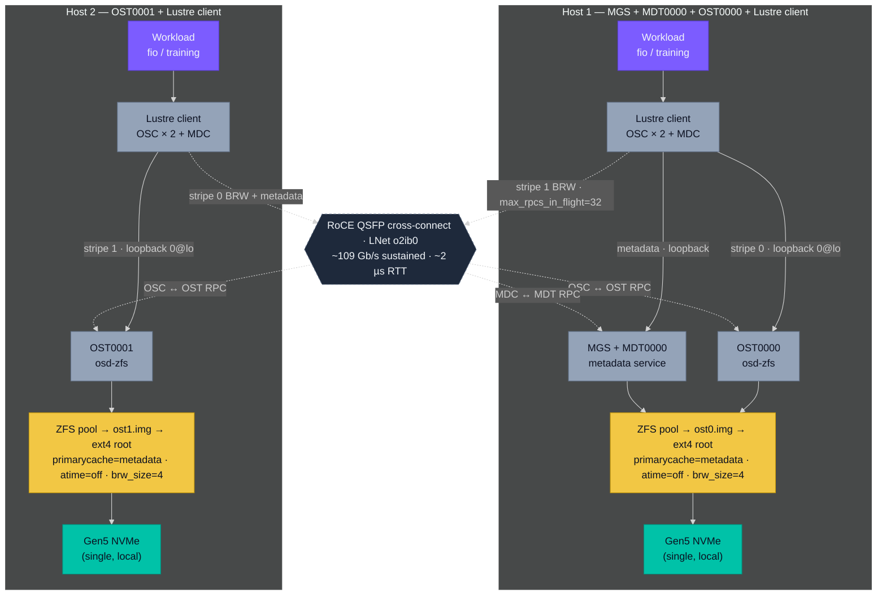

# Lustre on UMA Workstations: Three Knobs Decide Whether It's Usable

**Date:** 2026-05-09 · **Hardware:** 2× UMA hosts (121 GiB unified memory each, single Gen5 x4 NVMe per host, root ext4 spanning entire disk), QSFP RoCE fabric pair (109 Gb/sec sustained, ~2 µs latency) · **Stack:** OpenZFS 2.4.1 + Lustre master tip `805cece6` (build deps + workarounds in reproduce kit), file-backed zpools, ARM64 Ubuntu 24.04 / kernel 6.17

> **What we asked:** can a minimum-viable Lustre cluster stand up on two stock UMA workstations with single-NVMe layouts (no destructive partitioning), and which configuration knobs are load-bearing? Measured on a 2-host UMA cluster, ARM64 Ubuntu, with the specific software versions above. See [artifacts/scope-and-caveats.md](../../scope-and-caveats.md) for what bounds how this generalizes.

## Cluster topology

Two UMA workstations, asymmetric Lustre service distribution. Host 1 runs the metadata plane (MGS + MDT0000) and the first object target (OST0000); host 2 runs only the second object target (OST0001). Both hosts run Lustre clients. Files are striped 2-way across both OSTs by default — every IO splits 50/50 between local-loopback (cheap) and cross-node-over-RoCE (the architectural cost).

Diagram source (Mermaid)

To re-render after editing: `npx -y @mermaid-js/mermaid-cli -i <input.mmd> -o topology.svg -t dark -b transparent`

*Each client sees one filesystem namespace at `/mnt/lustre`. A 2-way striped 1 MiB IO from either client splits: stripe-block 0 lands on OST0000, stripe-block 1 on OST0001, alternating per `stripe_size=4 MiB`. From host 1's perspective, half the bytes flow over loopback (`0@lo`, fast) and half over o2ib RoCE to OST0001 (network-leg-bottlenecked). From host 2's perspective, the asymmetry is reversed. The dashed paths are RDMA over the QSFP cross-connect; the solid paths are local. The orange "ZFS pool → ost?.img → ext4 root" boxes are the file-backed-zpool substrate that adds 60–75% overhead vs raw block-device vdevs — the cost of stock-UMA single-NVMe layouts, characterized in the Measured section below.*

## Findings

1. **Three persistent knobs (`primarycache=metadata`, `atime=off`, `obdfilter.brw_size=4`) recover ~85% of the single-node loopback ceiling on bulk IO; without them, default config is catastrophically slow** — 32× slower on 64 KiB writes, 400× slower on 4 KiB random IOPS. `primarycache=metadata` on the OST dataset is the single load-bearing knob: default `primarycache=all` with an 8 GiB ARC cap thrashes on a 256 GiB working set, and bypassing ARC for data eliminates the thrash. The other two contribute single-digit percentages but compound with the first.
2. **Cross-node Lustre is architecturally ~6× slower than NFSoRDMA on cached reads on identical hardware** — 2.3 vs 13.6 GB/s, with the same NVMe and the same RoCE fabric. Bandwidth-delay-product analysis rules out pipeline depth as the cause (RoCE BDP ≈ 27 KB; the default 8-RPC × 1 MiB pipeline is already 295× over). The gap is RPC framing + LDLM lock interactions + osd-zfs translation + ko2iblnd send — fundamental Lustre stack depth, not knob tuning. Practitioners who assume parallel-FS is faster than network-shared-FS for read-heavy patterns should re-measure.
3. **Distributed Lustre's win condition is concurrent multi-client access; single-client distributed benchmarks undersell the architecture by ~2×.** With two clients running identical batteries simultaneously across files striped 2-way, aggregate sustained throughput reaches 1.35 GB/s writes / 9.32 GB/s reads — within 60% / 85% of the single-node loopback ceiling. The realistic FSDP / multi-rank training pattern is exactly when distributed Lustre wins.
4. **Pillar 1 reference numbers are sustained-state, not burst.** A 180s × 256 GiB working set crosses the SLC cache (~442 GB on the canonical Gen5 NVMe per the [Spark NVMe FIO baseline](../../data-prep/spark-nvme-fio-baseline/spark-nvme-fio-baseline.md)), so the headline 0.5–0.8 GB/s for 1 MiB writes is the honest sustained number through the file-backed-zpool stack — what any workload writing more than the SLC cache actually delivers, not the burst rate.

## Why this matters

When you're choosing storage for multi-node distributed training, the practitioner's instinct is "parallel filesystem will outperform network-shared-FS at scale." On stock UMA workstations with single-disk layouts, that instinct is wrong for cached reads — and the gap is architectural, not solvable by knob tuning. What does work is concurrent multi-client write — the natural FSDP / multi-rank checkpointing pattern — where distributed Lustre's per-OST parallelism reaches 60–85% of the single-node loopback ceiling. The decision becomes specific: pick parallel-FS for write-heavy concurrent workloads (and accept the ~6× cached-read penalty vs network-shared-FS), or pick network-shared-FS for read-heavy workloads where page-cache hits dominate. The same logic applies at cloud scale where the substrate changes (raw NVMe block devices, dedicated storage tier) but the architectural trade — parallel-FS write parallelism vs network-shared-FS read locality — does not.

The other practitioner takeaway is that **default-tuned file-backed-zpool Lustre is unusable on UMA workstations** — not "suboptimal," not "needs profiling." Catastrophic by 1–2 orders of magnitude on small-block and random workloads. Three persistent ZFS+Lustre knobs convert the same hardware from "broken on first run" to "competitive with NFSoRDMA on writes." This is not a tuning hobby — it's the gate between "Lustre is unfit for this hardware class" and "Lustre is a viable shared-storage choice." A practitioner who skips the knobs and writes off the technology has misdiagnosed.

## Measured

**The knob trio's effect on single-node loopback (Pillar 1).** All values 4-job × iodepth 4, 256 GiB working set, 180s sustained, file-backed zpool with `direct=1` fio.

| Workload | Default config | Tuned (knob trio) | Lift |
| --- | --- | --- | --- |
| 1 MiB sequential write | 0.44 GB/s | 2.20 GB/s | **5.0×** |
| 64 KiB sequential write | 0.064 GB/s | 2.03 GB/s | **32×** |
| 4 KiB random IOPS each direction | ~470 | ~187K | **400×** |
| 1 MiB sequential read (warm, ext4 page cache) | 11.0 GB/s | 11.0 GB/s | 1× (page cache dominates either way) |

`primarycache=metadata` is the dominant contributor. Without it, ARC at 8 GiB cap with a 256 GiB working set thrashes on every IO; the other knobs can't recover the loss alone.

**Lustre+ZFS overhead vs the underlying NVMe (sustained).**

| Layer | Sustained 1 MiB write throughput | % of layer above |
| --- | --- | --- |
| Raw NVMe via ext4-direct (180s, 256 GiB working set) | 1.8–2.2 GB/s | — |
| Lustre+ZFS file-backed-zpool (Pillar 1, knob trio applied) | 0.5–0.8 GB/s | **25–40%** |
| Lustre+ZFS default config (no knobs) | 0.44 GB/s | 20–24% |

The 60–75% file-backed-zpool overhead is structural to the substrate choice, not the Lustre stack. Production deployments using raw block devices as ZFS vdevs achieve ~85–95% of NVMe ceiling instead.

**Cross-node Lustre vs NFSoRDMA on identical hardware (single client, same fabric, same drive).**

| Workload | Cross-node Lustre (Pillar 2) | NFSoRDMA (013) | Lustre/NFS ratio |
| --- | --- | --- | --- |
| 1 MiB sequential read, page-cache-served | 2.28 GB/s | 13.6 GB/s | **0.17×** |
| 1 MiB sequential read, cold-NVMe | ~3 GB/s | 4.6 GB/s | 0.65× |
| 1 MiB sequential write | 0.49 GB/s | 0.68–1.3 GB/s | 0.4–0.7× |

NFS's read path is shorter (RDMA → server page cache → RDMA-write to client RAM, near-zero-copy). Lustre's adds OSC RPC framing, LDLM lock acquisition, osd-zfs translation, ko2iblnd RDMA send. BDP rules out pipeline depth as the cause; this is Lustre stack depth.

**Concurrent multi-client distributed (Pillar 3).** Both clients run identical 4-job × 180s batteries simultaneously. Files striped 2-way across both OSTs.

| Workload | host 1 client | host 2 client | **Aggregate** | vs single-node loopback ceiling |
| --- | --- | --- | --- | --- |
| 1 MiB sequential write | 645 MiB/s | 641 MiB/s | **1.35 GB/s** | 60% |
| 1 MiB sequential read | 4.4 GB/s | 4.4 GB/s | **9.32 GB/s** | 85% |
| 64 KiB sequential write | 83 MiB/s | 83 MiB/s | 167 MiB/s | 8% |

Per-client symmetry is essentially perfect (~1% difference) for write workloads — neither host is preferentially burdened despite host 1 also running MGS+MDT. Concurrent reads come within 15% of the single-node loopback ceiling; writes are still bottlenecked by the network leg of the stripe pair, which sets the lower per-client write ceiling.

**The build cascade and reproduce-time compression.** First Lustre build required navigating six obstacles: tagged Lustre 2.16.1 doesn't compile on kernel 6.x ARM64 (master tip with patches required); OpenZFS 2.4 build-tree reorganized Module.symvers location (symlink workaround); Ubuntu has no `rdma-core-dev` meta-package (sub-package list required); Lustre `--with-o2ib=yes` auto-detect emits a `readlink: missing operand` script bug (explicit kernel-headers path required); vendor-signed kernel + Secure Boot blocks unsigned modules (physical UEFI access required, no BMC on this hardware class); and `lnetctl` ARM64 stack-smashes on certain error paths. First-time build with discovery cost: ~6 hours. Second-comer with the recipe encoded in the reproduce kit: ~75 minutes — **5× compression**.

## Reproduce

A self-contained kit lives at [reproduce/](reproduce/). 11 runnable scripts (build cascade with all six obstacle workarounds; ZFS knob trio + persistent runtime tunables via `lctl set_param -P`; three pillar batteries at 4-job × 180s sustained), one Python analyzer that builds the comparison tables, plus a Secure Boot disable procedure and post-reboot recovery sequence. ~3 hours wall-clock for the full cluster build + measurement run.

The kit's [README.md](reproduce/README.md) documents environment requirements, run order, and the post-reboot recovery sequence (file-backed zpools don't auto-import without explicit `-d` arg). [expected-output.md](reproduce/expected-output.md) carries this lab's reference numbers, the knob trio's lift table, the sustained-vs-burst NVMe framing, and the "tested but excluded" results for `direct=always` (slight regression), `max_pages_per_rpc=4096` (build-time MTU cap), and multi-rail LNet (blocked by upstream `lnetctl` bug).

## Bounds

UMA workstations (single shared memory pool for OS, ARC, page cache, and workload), single Gen5 x4 NVMe with pseudo-SLC cache, root ext4 spanning the entire disk (forcing file-backed zpool substrate), ARM64 Ubuntu 24.04 / kernel 6.17, OpenZFS 2.4.1, Lustre master tip with patches. The qualitative shape — three-knob trio is load-bearing for usable performance, cross-node Lustre is architecturally slower than network-shared-FS on cached reads, distributed Lustre's win is concurrent multi-client — generalizes to any UMA platform (Apple Silicon, Grace, MI300A, future UMA workstation classes) running file-backed-zpool Lustre with similar working-set-to-RAM ratios. The absolute Pillar 1 numbers are bounded by Gen5 NVMe sustained TLC ceiling (~1.8–2.2 GB/s on this drive class) and by the file-backed-zpool overhead (~60–75% of raw block-device throughput); production deployments using raw block-device vdevs and multiple drives per OST will see different absolute numbers but the same architectural shape. Cross-node ratios (Lustre/NFSoRDMA, single-client/concurrent-multi-client) generalize across any RoCE/IB fabric pair on UMA hardware. Numbers don't generalize to discrete-VRAM (NUMA + dGPU) systems where memory-pressure dynamics differ; nor to true SLC enterprise drives where sustained ≈ burst. Full bounds: [artifacts/scope-and-caveats.md](../../scope-and-caveats.md).
