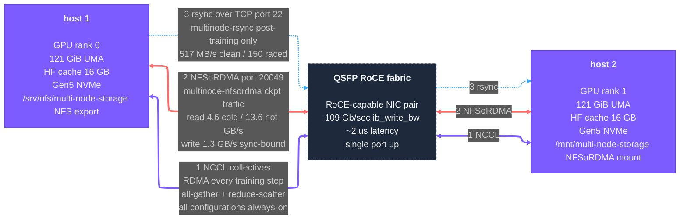

# Picking Shared Storage for Distributed Training: Measure Your Workload, Don't Inherit Defaults

**Date:** 2026-05-06 · **Hardware:** 2× UMA hosts (121 GiB unified memory, Gen5 NVMe), QSFP RoCE fabric pair (109 Gb/sec sustained, ~2 µs latency) · **Container:** `nvcr.io/nvidia/nemo-automodel:26.02` · **Recipe:** `examples/llm_finetune/qwen/qwen3_8b_squad_spark.yaml`

> **What we asked:** when sizing distributed-training storage, how do you choose between local-NVMe-with-sync-layer and shared-FS — and once you've chosen shared FS, how do you pick the underlying technology over your fabric? Measured on a 2-host UMA cluster, ARM64 Ubuntu, with the specific software versions above. See [artifacts/scope-and-caveats.md](../../scope-and-caveats.md) for what bounds how this generalizes.

## Cluster topology

Two UMA hosts connected by a single QSFP RoCE fabric. Three cross-host transports share the same physical link — each shows up in a different configuration below.

Diagram source (Mermaid)

To re-render after editing: `npx -y @mermaid-js/mermaid-cli -i <input.mmd> -o topology.svg -t dark -b transparent`

**RoCE = RDMA over Converged Ethernet.** All three transports share the same QSFP physical link — the fabric carries both RDMA verbs (NCCL, NFSoRDMA — kernel-bypass) and standard TCP/IP (rsync, SSH — full kernel network stack) over the same wire. The dramatic bandwidth gap (RDMA ~109 Gb/sec vs TCP-over-QSFP ~517 MB/s on the same link) is the kernel network-stack overhead that RDMA bypasses. Same wire, different layer.

## Findings

1. **Pick distributed-training storage by measuring your workload's read-vs-write dominance over your specific fabric, not by inheriting defaults.** Micro-benchmarks lie about fsync-bound regimes — RDMA wins everything synthetic but loses NFS sync writes to TCP by 13%. The decision method has two layers: shared FS vs sync-layer (always pick shared FS — see #2), then shared-FS technology by measurement on your actual access pattern (see #3). The 5× tax and 13% inversion below are worked examples of what falls out when you do this on commodity 2-node hardware; the method transfers to Lustre, WekaFS, FSx, Ceph, VAST, or anything else.
2. **Shared FS pays a 5× per-checkpoint tax during training to eliminate the post-training sync layer entirely — and wins on total cost for any run with ≥ ~3 checkpoints.** Per-node-local checkpointing with bidirectional rsync after training is fast per-checkpoint (~5 sec flat) but accumulates 5-20 minutes of post-training sync overhead; shared FS via NFSoRDMA is slower per-checkpoint (~22 sec flat) but the sync layer disappears. Total checkpoint cost across 3 ckpts: 14 sec local + 5-20 min sync = **6-20 min** vs **70 sec** shared FS. Plus the bidirectional-rsync pattern is race-prone under realistic conditions; shared FS is operationally simpler.
3. **In NFS sync-export regime, transport-bandwidth wins disappear for writes — fsync-rate dominates instead.** RDMA wins NFS reads by 5× (13.6 GB/s page-cache-served, 4.6 GB/s cold-NVMe — saturates fabric) but loses NFS writes by 13% (1.36 GB/s RDMA vs 1.55 GB/s TCP, both at 1MiB blocks). Mechanism: sync-export forces per-op fsync at the server, gating throughput by ~1300 fsync/sec rather than transport bandwidth. Predictive heuristic for sizing: budget reads at fabric-saturating rates, writes at server-fsync-bound rates. Don't generalize to "RDMA is slower for writes" — strip any one factor (async export, larger blocks, mature NFSoRDMA stack) and RDMA wins.
4. **Multi-node FSDP-2 sharded training eliminates the single-node UMA cold-cache consolidation penalty as a structural side effect, not just by rank-parallelizing.** On a single host, the second checkpoint of a run takes 7× longer than the first because the just-written DCP shard gets evicted from page cache before consolidation reads it back. At 2-host FSDP-2, per-rank memory pressure halves (~25 GB/ckpt per rank vs ~47 GB single-rank on 121 GiB UMA) and the shard stays cached — yielding a 16.6× speedup at the previously-cold checkpoint. Generalizes to any UMA platform where workload memory > ~50% of RAM, for any framework that shards state across ranks (FSDP-1/2, ZeRO-3, DeepSpeed stage 3).

## Why this matters

Most AI infrastructure storage decisions inherit defaults — "use the parallel FS the cluster came with," "RDMA is faster than TCP, pick RDMA," "checkpoint to local NVMe and sync after." Each of those defaults is right in some regime and wrong in others, and the cost of being wrong is real money: idle GPUs during sync windows, wasted fabric bandwidth, undersized server-side fsync rates, surprise restore failures when only one node has a singleton file. The method here is generic: walk the workload's actual access pattern (read-bound restore vs write-bound checkpoint), measure the candidate shared-FS techs over your specific fabric, and accept that micro-benchmark numbers don't survive contact with the access regime. The home-lab story is two UMA boxes and NFSoRDMA because that's what the lab had; the same method applied to Lustre on a 100 Gb fabric, FSx on a managed cloud network, or Ceph on commodity Ethernet should produce a sized, defensible storage architecture rather than a vendor recommendation.

## Measured

**Where bytes physically land.** All three configurations run the same workload (250-step SFT on Qwen3-8B with `ckpt_every_steps=100`, producing 3 checkpoints) but place checkpoint data physically very differently.

```mermaid
%%{init: {'theme':'dark', 'flowchart': {'defaultRenderer': 'elk'}}}%%
flowchart LR
    classDef compute    fill:#7C5CFF,stroke:#5B3DD9,color:#F1F5F9,stroke-width:1px
    classDef checkpoint fill:#FF6B6B,stroke:#C13A3A,color:#0B1020,stroke-width:1px

    subgraph CFG_A["single-node"]
        direction TB
        AR0["host 1 rank 0"]:::compute
        AHost2["host 2 idle"]:::compute
        ANVMe["host 1 NVMe<br>3 ckpts x 62 GB<br>= 186 GB local"]:::checkpoint
        AR0 -->|"local checkpoint write<br>hot-cold variance 7x<br>11 to 79 sec per ckpt"| ANVMe
    end

    subgraph CFG_B["multinode + rsync"]
        direction TB
        BR0["host 1 rank 0"]:::compute
        BR1["host 2 rank 1"]:::compute
        BLocal0["host 1 NVMe<br>27 GB per ckpt<br>plus singletons<br>rank-0 view"]:::checkpoint
        BLocal1["host 2 NVMe<br>32 GB per ckpt<br>rank-1 view"]:::checkpoint
        BR0 -->|"local write<br>~5 sec flat per ckpt<br>cache stays hot"| BLocal0
        BR1 -->|"local write"| BLocal1
        BLocal0 <-.->|"rsync over TCP<br>5.7 min clean<br>20 min with race<br>post-training only"| BLocal1
    end

    subgraph CFG_C["multinode + NFSoRDMA"]
        direction TB
        CR0["host 1 rank 0"]:::compute
        CR1["host 2 rank 1"]:::compute
        CNFS["host 1 NVMe<br>NFS export sync mode<br>3 ckpts x 62 GB = 186 GB<br>host 2 NVMe accumulates 0 bytes"]:::checkpoint
        CR0 -->|"local write to NFS-export tree<br>sync export inherited"| CNFS
        CR1 -->|"NFSoRDMA write<br>22-24 sec flat per ckpt<br>fsync-rate-bound"| CNFS
    end

    %% Force LR layout order CFG_A -> CFG_B -> CFG_C with subtle dashed connectors
    ANVMe -.-> BR0
    BLocal1 -.-> CR0
    linkStyle 6,7 stroke:#64748B,stroke-width:1px,stroke-dasharray: 3 5
```

Diagram source (Mermaid)

To re-render after editing: `npx -y @mermaid-js/mermaid-cli -i <input.mmd> -o checkpoint-placement.svg -t dark -b transparent`

The single-node configuration is the cold-cache-penalty baseline (7× hot/cold spread). Multinode + rsync distributes data across both NVMes during training (each rank's per-ckpt memory pressure halves → DCP shard stays cached → 1.06× hot/cold ratio) but adds the post-training sync layer. Multinode + NFSoRDMA centralizes all bytes on host 1's NVMe via the shared mount; host 2's NVMe accumulates zero bytes during checkpointing.

**The three configurations.**

| Metric | Single-node | 2-node + post-training rsync | 2-node + NFSoRDMA shared FS |
|---|---|---|---|
| Wall-clock | 17 min | 30 min + 6-20 min sync | 28 min |
| Throughput | 15.6 steps/min | 595 tps aggregate | ~600 tps aggregate |
| Memory plateau per rank | 61.5 GiB | 35.5 GiB | 35.5 GiB |
| Per-ckpt sync block (cache-hot) | 11 sec | 4.5 sec | 21 sec |
| Per-ckpt sync block (cache-cold) | 79 sec | 4.8 sec | 24 sec |
| Hot/cold variance | 7× | 1.06× | 1.13× |
| Total ckpt block (3 ckpts) | ~120 sec | ~14 sec | ~70 sec |
| Post-training sync overhead | 0 | 5.7-20 min | 0 |
| **Total checkpoint cost** | **120 sec (single-node only)** | **~6-20 min** | **70 sec** ← lowest |
| Mutually recoverable mid-training | n/a | NO (rank 1 lacks singletons) | YES (shared FS) |

**Transport A/B over the same fabric, same export.** NFS sync-export, 1MiB blocks, 16 GB working set:

| Job | RDMA | TCP | RDMA / TCP |
|---|---|---|---|
| seq-read-1m | 13.6 GB/s | 2.74 GB/s | 5.0× faster on RDMA |
| seq-write-1m | 1.36 GB/s | 1.55 GB/s | **0.88× — TCP 13% FASTER** |
| rand-rw-4k | ~5.5 + 5.5 MB/s | ~5.3 + 5.3 MB/s | ~1.04× — basically identical |

**NFSoRDMA read characterization (3 regimes, sequential 1MiB):**

| Working set | Bandwidth | clat p50 / p99 |
|---|---|---|
| 16 GiB (0.13× RAM) — page-cache-served | 13.6 GB/s | 1.14 / 1.45 ms |
| 128 GiB (1.06× RAM) — readahead-masked, 180 sec | 13.5 GB/s | 1.14 / 3.10 ms |
| 512 GiB (4.2× RAM) — cold-NVMe-bound, 180 sec | 4.6 GB/s | 3.54 / 4.88 ms |

Kernel readahead masks NVMe-bound reads through working sets that exceed RAM by ~6%; honest cold-NVMe performance only emerges at ≥ 4× RAM with sustained runtime ≥ 180 sec. Implication for benchmark methodology: small working sets lie about steady-state.

**TP6 cold-cache restore over NFSoRDMA via NeMo's loader.**

| Metric | Value |
|---|---|
| Restore wall-clock | ~37 sec for ~50 GB cluster-wide checkpoint |
| Sustained NFS-server NVMe read | ~1.4 GB/s (peak ~1.7 GB/s) |
| Effective bandwidth | ~1.4 GB/s |
| NFSoRDMA cold-NVMe ceiling (fio) | 4.6 GB/s |
| NeMo loader extraction | ~30% of fio ceiling → ~3.3× loader-pattern tax |
| Compared to local-NVMe NeMo restore baseline | ~1.6× faster in absolute terms |
| Remote rank's local NVMe reads during restore | ~0 (NFSoRDMA carries the bytes) |

The loader-pattern tax (NeMo reads single-thread mmap) is the same order of magnitude on local NVMe and on NFSoRDMA — the network FS doesn't penalize the loader pattern further; absolute throughput wins because the underlying ceiling is higher.

## Reproduce

A self-contained kit lives at [reproduce/](reproduce/). 12 runnable scripts (NFSoRDMA setup, three training-config runs, post-training sync, cold-cache restore, two analyze scripts) plus README and reference numbers. Walks the full three-way comparison + TP6 measurement in ~95 minutes of cluster wall-clock and ~620 GB peak disk on the NFS-server-designated host. The kit's [README.md](reproduce/README.md) lists environment requirements (2 UMA hosts with RDMA-capable fabric pair, Docker, Hugging Face token with Qwen3-8B accepted) and the cherry-pick section identifies which scripts work standalone outside the kit (NFSoRDMA setup + log analyzers). [expected-output.md](reproduce/expected-output.md) carries the reference numbers above for sanity-checking on similar hardware.

## Bounds

Two-host UMA cluster, ARM64 Ubuntu, NFS sync-export with 1MiB blocks, NeMo Automodel 26.02 with synchronous DCP+HF checkpoint pipeline. **The decision method generalizes** to any distributed-training storage choice over any fabric — Lustre, WekaFS, FSx, Ceph, VAST, parallel FS, NFSoRDMA. **The qualitative shape** of each finding (cold-cache penalty disappearance under sharded multi-node training, fsync-bound regime inversion, ~3× loader-pattern tax) generalizes to UMA platforms with similar memory-to-checkpoint-size ratios and to any framework with the asymmetric-write-symmetric-read assumption (FSDP-1/2, ZeRO-3, DeepSpeed stage 3). **Absolute numbers** (5× per-ckpt tax, 13% TCP-vs-RDMA inversion, 1.4 GB/s effective TP6, ~70 sec total checkpoint cost) are platform- and workload-specific. NFS `async` export, larger block sizes, or maturation of the NFS-over-RDMA stack would shift the regime where TCP wins writes; cold-cache RDMA-vs-TCP behavior under NVMe-bound conditions is untested. Full bounds: [artifacts/scope-and-caveats.md](../../scope-and-caveats.md).
