# benchmark-harness

Reusable, declarative harness for unattended storage benchmarking across multi-node clusters. Define scenarios in YAML, walk away for a day, return to a SQLite database of normalized metrics and a markdown comparison report.

## Why

`fio` is the right tool for block-level storage measurement, but every new study repeats the same plumbing — orchestrating runs, dropping caches between jobs, parsing JSON, comparing against vendor spec, diffing against prior runs, recovering from a crash mid-campaign. This harness encodes that plumbing once. You author scenarios, point them at storage targets, and the harness handles the rest.

The harness was built to support a personal AI-infrastructure storage lab; it's open-source and intentionally generic. Same scenario can run against local NVMe, Lustre, NFS, or NFS-over-RDMA with no code changes — just a different campaign file.

## Status

- **v0**: fio runner end-to-end. Validated against a known-good baseline (see [Validation](#validation) below).
- **v0.1** (planned): MLPerf Storage / dlio_benchmark runner.

## Architecture

The harness has one **main data flow** (left → right: inputs → execution → collection → reporting → output) and one **shared foundation** (SSH automation) called by the execution layer whenever it needs to touch a remote node:



Diagram source: [docs/architecture.mmd](docs/architecture.mmd) (Mermaid, dark theme, Storage Spectrum palette). Re-render after editing:

```bash
npx -y @mermaid-js/mermaid-cli -i docs/architecture.mmd -o docs/architecture.svg -t dark -b transparent
```

| Component | Module(s) | Responsibility |
| --- | --- | --- |
| **Execution** | `harness/orchestrator.py`, `harness/runners/*.py` | Walk Campaign sequentially. Dispatch each scenario to the right `Runner`. Resume-from-crash via SQLite. |
| **Collection** | `harness/parsers/*.py`, `harness/store.py` | Parse tool output to normalized `(scenario, job, op, metric, value)` rows. Persist in SQLite; raw outputs land in `results/raw/<run_id>/`. |
| **Reporting** | `harness/report.py` | Query SQLite, render markdown via Jinja2. Spec-comparison + cross-run diff support. |
| **Automation** (foundation, called by Execution) | `harness/ssh.py` | `ssh -o BatchMode=yes`. Sudo calls auto-add `-t`. Per-target preflight (mkdir, df). Every Execution module that touches a remote node calls into this. |

## Quick start

Requires Python 3.11+, [uv](https://docs.astral.sh/uv/), and `ssh` access to your target nodes.

```bash
git clone <repo> && cd benchmark-harness
uv sync --extra dev
uv run pytest -q                    # 81 tests should pass

# Validate the example campaign + scenario
uv run harness validate campaigns/examples/nvme-baseline.yaml

# Copy the example into your own experiment dir and edit ssh + path fields:
mkdir -p ~/experiments/001-baseline
cp campaigns/examples/nvme-baseline.yaml ~/experiments/001-baseline/campaign.yaml
# ... edit cluster.nodes[].ssh, targets[].path, scenarios_dir ...

# Preflight (real SSH, read-only — verifies capacity & path):
uv run harness preflight ~/experiments/001-baseline/campaign.yaml

# Run (unattended; ~30 min for the 8-job NVMe baseline):
tmux new -s harness
uv run harness run ~/experiments/001-baseline/campaign.yaml

# Render report:
uv run harness list-runs
uv run harness report <run-id>
# → results/reports/<run-id>.md
```

## Concepts

The harness separates **what to measure** (scenarios, public, reusable) from **where to measure it** (campaigns, private, target-specific).

### Scenario — the recipe

Target-agnostic. Defines fio jobs + global settings. Lives at `scenarios/<tool>/<name>.yaml`. Versioned, shared.

```yaml
# scenarios/fio/nvme-baseline-8job.yaml (excerpt)
kind: fio
name: nvme-baseline-8job
description: 8-job canonical sweep covering seq, rand, latency, and mixed.

global:
  ioengine: libaio          # libaio matches the canonical 007 methodology
  direct: 1
  time_based: 1
  runtime: 180
  ramp_time: 10
  end_fsync: 1
  size: 2T                  # testfile size

drop_caches_between_jobs: true
timeout_seconds: 600        # per-job safety bound

jobs:
  - { name: seqwrite-1t,   rw: write,  bs: 1M, numjobs: 1,  iodepth: 1 }
  - { name: seqwrite-16t,  rw: write,  bs: 1M, numjobs: 16, iodepth: 1,
      offset_increment: 128g, size: 128g }
  # ... 6 more jobs
```

### Campaign — the binding

Binds a scenario to a specific node + path + vendor reference. Lives wherever you put your experiment work (typically gitignored).

```yaml
# experiments/001-baseline/campaign.yaml
name: nvme-baseline-spark01
description: 8-job sweep against the local NVMe.

cluster:
  nodes:
    - { name: spark01, ssh: kumar@192.168.20.21 }

targets:
  - name: spark01-nvme
    node: spark01
    path: /home/kumar/bench-harness/
    kind: local-nvme
    capacity_gib: 3700

vendor_spec:                                        # for "% of spec" columns
  label: Samsung 9100 PRO 4 TB (Gen5 x4)
  seqwrite_mbps: 13400
  seqread_mbps: 14800
  randread_iops: 2200000
  randwrite_iops: 2600000

scenarios_dir: ../../benchmark-harness/scenarios    # relative to this file
cleanup: after_campaign                             # after_campaign | after_each_run | never
safety_margin_gib: 100

runs:
  - { scenario: fio/nvme-baseline-8job.yaml, target: spark01-nvme }
```

The same scenario can run against multiple targets — just add more `targets` and more `runs`:

```yaml
targets:
  - { name: nvme,   node: spark01, path: /home/kumar/bench/,       kind: local-nvme }
  - { name: lustre, node: spark01, path: /mnt/lustre/bench/,       kind: lustre }
  - { name: nfs,    node: spark01, path: /mnt/nfs-rdma/bench/,     kind: nfs }
runs:
  - { scenario: fio/nvme-baseline-8job.yaml, target: nvme }
  - { scenario: fio/nvme-baseline-8job.yaml, target: lustre }
  - { scenario: fio/nvme-baseline-8job.yaml, target: nfs }
```

One unattended campaign produces three storage tiers in the same report, comparable side-by-side.

## CLI

```text
harness validate <campaign.yaml>     # schema-check; no SSH, no writes
harness preflight <campaign.yaml>    # SSH each node; verify path + capacity
harness run <campaign.yaml>          # preflight, then execute (unattended)
harness resume [<campaign.yaml>]     # resume the latest in-progress run
harness list-runs                    # show stored runs, newest first
harness report <run-id>              # render markdown to results/reports/<run-id>.md
```

`harness run` exits `0` on success, `1` on couldn't-load/preflight-failed, `2` if at least one scenario failed. CI scripts can branch on those codes.

Long-running campaigns emit progress to both stdout and `results/raw/<run-id>/orchestrator.log` — `tail -f` from another terminal works.

## Setup requirements

One-time setup on each node the harness will SSH to:

```bash
# Passwordless sudo for cache drops (drop_caches_between_jobs=true)
ssh -t <user>@<node> 'echo "<user> ALL=(root) NOPASSWD: /usr/bin/sync, /usr/bin/tee /proc/sys/vm/drop_caches" | sudo tee /etc/sudoers.d/<user>-cache-drop && sudo chmod 0440 /etc/sudoers.d/<user>-cache-drop && sudo visudo -c -f /etc/sudoers.d/<user>-cache-drop'

# Verify (should print OK with no password prompt):
ssh <user>@<node> 'sudo -n sync && echo 3 | sudo -n tee /proc/sys/vm/drop_caches > /dev/null && echo OK'
```

If you don't want NOPASSWD, set `drop_caches_between_jobs: false` in the scenario. Be aware that cache state from prior jobs will leak through and inflate read measurements.

## Methodology guards

The harness encodes four guards learned the hard way. Each is documented at the relevant source location.

1. **Testfile prefill, not just `fallocate`.** `fallocate -l SIZE` reserves disk blocks but leaves the file's extents in the "unwritten" state. ext4 reads from unwritten extents — even with `O_DIRECT` — by returning zeros from a kernel zero-page, *without issuing I/O to the drive*. That breaks read benchmarks: reported bandwidth exceeds the PCIe link's physical ceiling because most "reads" never touched NAND. The harness pre-writes the full testfile via fio (`--rw=write --bs=1M`) before any measurement job runs, forcing every extent into the "written" state. A sibling `<testfile>.prefilled` marker is created on success so subsequent runs skip re-prefill. **Source**: `harness/runners/fio.py` (module docstring).

2. **Refuse to silently extend an undersized testfile.** If an existing testfile is smaller than the scenario requires, `fio` would happily extend it mid-run — silently filling the drive and breaking the run. The harness aborts with a clear message asking the operator to remove the file first. **Source**: `harness/runners/fio.py` `_allocate_testfile` neighborhood.

3. **Wrap detection.** Multi-thread `fio` jobs with `offset_increment` + per-job `size=` bound each thread to a region. If a thread completes its region inside `runtime`, it loops back; the second pass serves from drive DRAM or kernel page cache, inflating the measured bandwidth. The report flags any row where `per_thread_bw × runtime > per_thread_region` (10% slack) with `⚠ wraps (cache-amplified)`. Writes are excluded — `direct=1` writes go to disk every time. **Source**: `harness/report.py` `_detect_wrap`.

4. **Unattended-safe `sudo -n` cache drops.** Cache drops use two whitelisted commands (`sync`, `tee /proc/sys/vm/drop_caches`) with `sudo -n` (non-interactive). Fails fast in <1s if NOPASSWD isn't configured, instead of timing out at 60s waiting for a password prompt. **Source**: `harness/runners/fio.py` `_drop_caches`.

## Validation

The reference scenario `scenarios/fio/nvme-baseline-8job.yaml` is a faithful port of a manually-built 8-job NVMe benchmark suite. Running it through the harness against the same hardware that produced the original baseline reproduced the multi-thread sequential read ceiling within **0.05%** (10,507 MB/s vs 10,512 MB/s ground truth), and the central finding — post-SLC sustained write rate is ~13% of spec — within 3%. Latency-floor and random-write metrics show typical run-to-run variance (~10-15%); all numbers are physically grounded (no `⚠ wraps` annotations).

## Adding a new scenario

1. Drop a YAML file under `scenarios/<tool>/<name>.yaml`.
2. `uv run harness validate <a campaign that references it>` to schema-check.
3. Add a campaign or reuse an existing one with a `runs:` entry pointing at the new scenario.

The fio renderer auto-emits `offset_increment=` and per-job `size=` if you declare them. Multi-thread jobs without `offset_increment` are rejected at schema time — a hard guard against the [shared-byte-ranges cache-amplification bug](https://github.com/axboe/fio/blob/master/HOWTO.rst#cmdoption-arg-offset-increment).

## Adding a new tool runner

The `Runner` ABC in `harness/runners/base.py` is three methods: `prepare`, `run_jobs`, `cleanup`. The fio runner is ~300 lines and a good reference. Register the new runner in `harness/orchestrator.py`'s `_RUNNERS` dict, keyed by the scenario `kind` discriminator.

## Project layout

```text
benchmark-harness/
├── harness/                          # Python package
│   ├── cli.py                        # `harness validate | run | resume | report | list-runs | preflight`
│   ├── config.py                     # pydantic schemas
│   ├── ssh.py                        # Layer 1
│   ├── orchestrator.py               # Layer 2 glue
│   ├── runners/{base.py, fio.py}     # Layer 2 — tool-specific
│   ├── parsers/fio.py                # Layer 3
│   ├── store.py                      # Layer 3 — SQLite
│   └── report.py                     # Layer 4
├── scenarios/fio/*.yaml              # Reusable recipes
├── campaigns/examples/*.yaml         # Example campaigns
└── tests/                            # 81 tests, ~0.25s
```

## License

[Apache-2.0](../LICENSE-CODE). Contributions welcome via GitHub issues / PRs.
