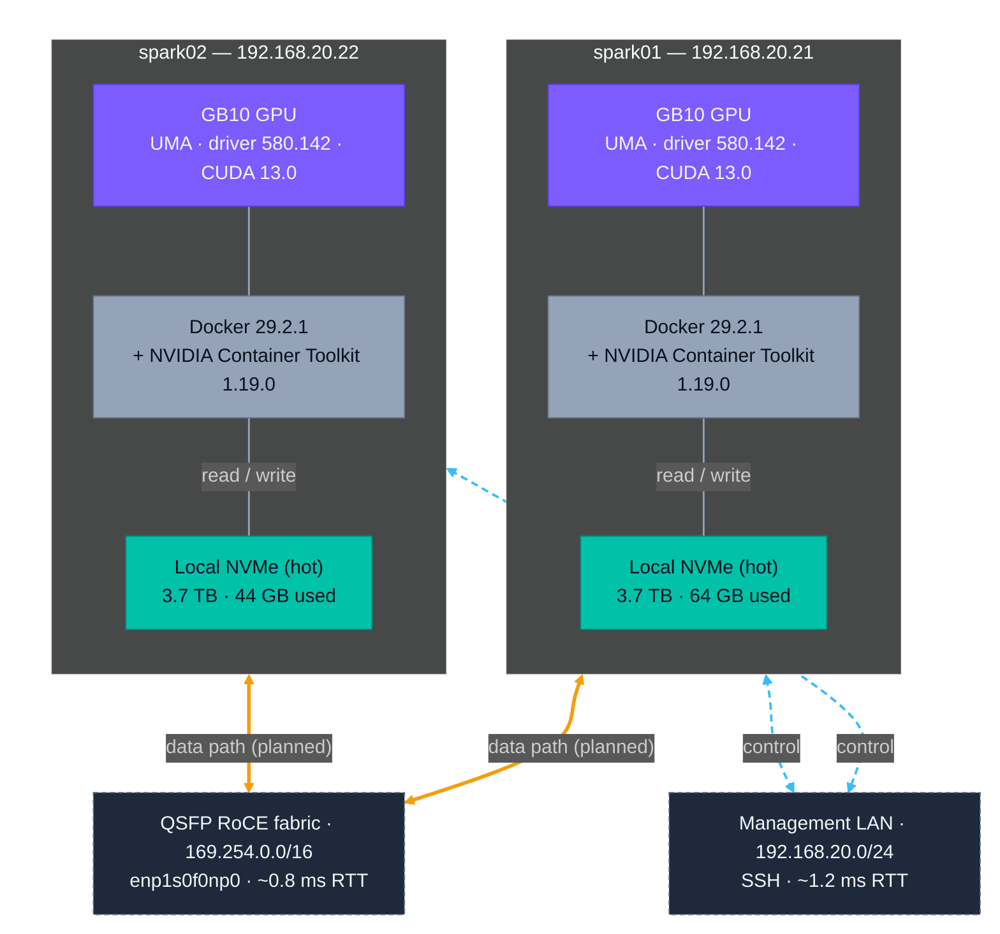

# DGX Spark Cluster — Environment Reference

## Topology



*Caption:* Two DGX Spark nodes share a common management LAN for control and a direct QSFP RoCE fabric reserved for high-bandwidth data movement (cross-node training, checkpoint sync). Each node has a dedicated 3.7 TB local NVMe — currently the only storage tier in use; GCS and any network storage will be added later as separate experiments.

## Nodes at a Glance

| Property | Node 1 — `spark01` | Node 2 — `spark02` |
|----------|-------------------|-------------------|
| **Hostname** | `spark01` | `spark02` |
| **SSH user** | `sparks` | `sparks` |
| **SSH IP** | `192.168.20.21` | `192.168.20.22` |
| **QSFP interface** | `enp1s0f0np0` ✅ Up | `enp1s0f0np0` ✅ Up |
| **QSFP IP** | `169.254.188.115` | `169.254.10.122` |
| **GPU** | NVIDIA GB10 (Blackwell) | NVIDIA GB10 (Blackwell) |
| **GPU driver** | 580.142 | 580.142 |
| **CUDA version (driver)** | 13.0 | 13.0 |
| **`nvcc` toolkit** | 13.0.88 | 13.0.88 |
| **Docker** | 29.2.1 | 29.2.1 |
| **NVIDIA Container Toolkit** | 1.19.0 | 1.19.0 |
| **OS** | Ubuntu (ARM64) | Ubuntu (ARM64) |

---

## Network Details

### Management network
- Subnet: `192.168.20.0/24`
- Node 1 → `enP7s7 @ 192.168.20.21`
- Node 2 → `enP7s7 @ 192.168.20.22`

### High-speed inter-node link (QSFP/RoCE)
- Interface: `enp1s0f0np0` (Up on both nodes)
- Node 1 IP: `169.254.188.115/16`
- Node 2 IP: `169.254.10.122/16`
- Cross-node latency: **~1.7ms avg, 0% packet loss** (verified)

### Full interface listing (Node 1)

```
lo             127.0.0.1/8
enP7s7         192.168.20.21/24    ← management / SSH
enp1s0f0np0    169.254.188.115/16  ← QSFP high-speed (Up) ✅
wlP9s9         192.168.10.169/24   ← WiFi
docker0        172.17.0.1/16       ← Docker bridge
```

### Full interface listing (Node 2)

```
lo             127.0.0.1/8
enP7s7         192.168.20.22/24    ← management / SSH
enp1s0f0np0    169.254.10.122/16   ← QSFP high-speed (Up) ✅
wlP9s9         192.168.10.185/24   ← WiFi
docker0        172.17.0.1/16       ← Docker bridge
```

### ibdev2netdev output (both nodes)

```
rocep1s0f0    port 1 ==> enp1s0f0np0   (Up)    ← use this
rocep1s0f1    port 1 ==> enp1s0f1np1   (Down)
roceP2p1s0f0  port 1 ==> enP2p1s0f0np0 (Up)
roceP2p1s0f1  port 1 ==> enP2p1s0f1np1 (Down)
```

---

## GPU Details

- **Architecture:** Blackwell (GB10)
- **Unified Memory Architecture (UMA):** GPU and CPU share memory dynamically
- GPU memory reported as "Not Supported" in `nvidia-smi` — expected on DGX Spark UMA
- Active GPU processes at discovery time: Xorg, gnome-shell (desktop sessions)

> If you hit memory pressure, flush the buffer cache:
> ```bash
> sudo sh -c 'sync; echo 3 > /proc/sys/vm/drop_caches'
> ```

---

## Software Environment

### CUDA
- Driver-reported CUDA: **13.0**
- `nvcc` (CUDA toolkit): **not installed on host** — not needed; CUDA is bundled inside the vLLM Docker image

### Docker
- Version: **29.1.3**
- No `sudo` required (sparks user is in the `docker` group)
- NVIDIA Container Toolkit: **1.19.0** — GPU passthrough to containers confirmed available

### vLLM Container
- Registry: `nvcr.io/nvidia/vllm`
- Target version: **`26.02-py3`** (Feb 2026 release, latest at time of setup)
- Export variable: `VLLM_IMAGE=nvcr.io/nvidia/vllm:26.02-py3`

---

## Key Environment Variables (for scripts)

```bash
# ── Node 1 ──────────────────────────────────────────────
NODE1_SSH="sparks@192.168.20.21"
NODE1_QSFP_IP="169.254.188.115"

# ── Node 2 ──────────────────────────────────────────────
NODE2_SSH="sparks@192.168.20.22"
NODE2_QSFP_IP="169.254.10.122"

# ── Shared ──────────────────────────────────────────────
MN_IF_NAME="enp1s0f0np0"         # overrides README's enp1s0f1np1 (that is Down)
VLLM_IMAGE="nvcr.io/nvidia/vllm:26.02-py3"
HF_CACHE="$HOME/.cache/huggingface"
WORK_DIR="~/vllm-cluster-kn"     # created on both nodes 2026-03-29
```

---

## Conventions — Secrets and Tokens

Tokens persist across container exits and host reboots only when stored in a host file. In-container `export` does not survive `--rm`. The lab convention: store each secret as a strict-perm file in the `sparks` user's home on each node, then pass it into containers via `-e VAR="$(cat <file>)"` at `docker run` time.

### Hugging Face token

- **File:** `~/.huggingface_token` on each node (mode 600, owned by `sparks`).
- **One-time setup per node:**
  ```bash
  read -s HFT && echo "$HFT" > ~/.huggingface_token && unset HFT
  chmod 600 ~/.huggingface_token
  ```
  `read -s` keeps the token out of bash history.
- **Use in `docker run`:** add `-e HF_TOKEN="$(cat ~/.huggingface_token)"` to the launch command. The `$(...)` substitution strips the trailing newline from `cat`, so no extra processing needed.

### What NOT to do

- Do not `export HF_TOKEN=...` in `~/.bashrc` — leaks to every shell session and to `env` output.
- Do not paste the token into any tracked file (experiment plans, step logs, lessons, etc.).
- Do not place the token at any path inside this repo's working tree.

## References
- [DGX Spark Performance Spec](https://docs.nvidia.com/dgx/dgx-spark/hardware.html#performance-specifications)
